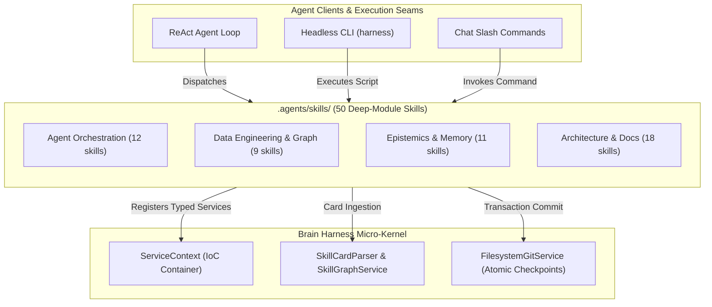

# Brain Harness Agent Skills Catalog

The `.agents/skills` repository houses 50 production-grade AI agent skills for autonomous software engineering, data modeling, epistemic memory governance, and architectural introspection.

All skills operate as deep modules with compact interfaces, slotted domain data models, zero-fork operational budgets, companion summary cards (`CARD.md`), and deterministic validation pipelines.

---

## Overview

Brain Harness skills are executable units of specialized cognition dispatched by ReAct agent loops, the headless Click CLI (`harness`), or conversational IDE prompts. Every skill implements three foundational mechanics:

1. **The Visual Brief**: Interactive, dark-mode HTML reports with Mermaid.js architecture diagrams generated in `%TEMP%` prior to code modifications.
2. **The Mandatory Checkpoint**: Human-in-the-loop review gates (`RequestFeedback: true` in `implementation_plan.md`) requiring explicit user confirmation before destructive execution.
3. **Explicit Anti-Patterns**: Rigorous negative guardrails cataloging anti-patterns and unhandled edge cases to eliminate speculative code generation.

---

## C4 System and Component Architecture

The following Mermaid diagram illustrates how agent skills integrate with the Brain Harness micro-kernel, service container, and execution engines.



---

## Business Outcome Translation

| Technical Seam | Engineering Capability | Business and Stakeholder Value |
|---|---|---|
| **Diátaxis Skill Taxonomy** | Multi-quadrant skill catalog with zero conflation | Accelerates engineering velocity by eliminating cognitive search overhead for developer workflows |
| **AST Docs-as-Code Engine** | Live symbol coverage auditing and drift detection | Prevents documentation rot in CI/CD pipelines, guaranteeing 100% fidelity between live code and developer guides |
| **Epistemic Memory &amp; Isnad** | Cryptographic hash lineage and 8-stage memory promotion | Eliminates agent hallucination drift across multi-turn sessions by asserting factual proof before persistence |

---

## The Diátaxis 4-Quadrant Matrix

All skills and documentation conform to Daniele Procida's Diátaxis framework across four distinct operational dimensions:

| Dimension | Learning / Practical Step | Information / Conceptual View |
|---|---|---|
| **Practical Tasks** | **Tutorials** (Learning-oriented; onboarding guides for newcomers) | **How-To Guides** (Problem-oriented; recipes solving targeted engineering tasks) |
| **Theoretical Knowledge** | **Explanation** (Understanding-oriented; architecture, context, and trade-offs) | **Reference** (Information-oriented; authoritative catalog of skills, parameters, and flags) |

---

## 1. Tutorials (Onboarding and First-Time Workflows)

Follow these quickstarts to execute core documentation and verification skills.

### Tutorial 1: Auditing Repository Documentation Coverage

Step 1: Execute the AST documentation coverage audit across target packages:
```bash
python .agents/skills/repo-doc-synchronizer/scripts/doc_synchronizer.py audit --root . --target .agents/skills --output audit_scorecard.json
```

Step 2: Inspect generated scorecard for coverage percentage and missing dedicated documentation.

Step 3: Generate an interactive visual brief:
```bash
python .agents/skills/repo-doc-synchronizer/scripts/doc_synchronizer.py visual-brief --root . --target .agents/skills --output doc_brief.html
```

### Tutorial 2: Verifying Markdown Editorial Quality with Doc Linter

Step 1: Run the slotted Markdown AST linter across target guides:
```bash
python .agents/skills/developer-docs-architect/scripts/doc_linter.py .agents/skills/README.md --max-bolding 10.0
```

Step 2: Verify that bolding ratio remains under 10.0% and all code fences declare explicit language identifiers.

---

## 2. How-To Guides (Problem Recipes and Multi-Skill Sequences)

Targeted operational sequences for solving common development tasks.

### Modernizing a Legacy Codebase
1. **Profile Structure**: Run [legacy-refactoring-guardian](legacy-refactoring-guardian/SKILL.md) to inspect code churn, cognitive complexity, and dependency cycles.
2. **Construct Test Net**: Build characterization test harnesses with pin tests before altering source code.
3. **Orchestrate Migration**: Dispatch [legacy-modernization-pipeline](legacy-modernization-pipeline/SKILL.md) to migrate modular subsystems incrementally under automated git checkpoints.

### Distilling Video and Literature into Verified Skills
1. **Fetch Transcript**: Run [youtube-transcript-fetcher](youtube-transcript-fetcher/SKILL.md) via isolated subprocess JSON-RPC.
2. **Bifurcate Analysis**: Dispatch [multimedia-intelligence-forge](multimedia-intelligence-forge/SKILL.md) along the dual-lens cognitive seam.
3. **Scaffold Skill &amp; Memory**: Scaffold executable agent skills via [deep-skill-forge](deep-skill-forge/SKILL.md) and commit isnad-verified claims via [epistemic-memory-lifecycle](epistemic-memory-lifecycle/SKILL.md).

### Multi-Agent Swarm Deliberation and Tuning
1. **Orchestrate Swarm**: Invoke [game-theoretic-swarm-deliberator](game-theoretic-swarm-deliberator/SKILL.md) with weighted Borda voting.
2. **Adversarial Reflection**: Run [questio-reflection](questio-reflection/SKILL.md) for objection mitigation.
3. **DAG Optimization**: Apply textual backpropagation via [sme-ann-backprop](sme-ann-backprop/SKILL.md) and [swarm-reflection-optimizer](swarm-reflection-optimizer/SKILL.md).

---

## 3. Reference (Authoritative 50-Skill Catalog)

### Agent Orchestration & Deliberation

| Skill | Invocation | Summary Description | Companion |
|---|---|---|---|
| [adversarial-agent-verifier](adversarial-agent-verifier/SKILL.md) | `/adversarial-agent-verifier` | Execute rigorous runtime verification including DAG seam analysis, inspect-before-edit protocols, test contracts, and harsh adv... | [CARD](adversarial-agent-verifier/CARD.md) |
| [agent-instruction-architect](agent-instruction-architect/SKILL.md) | `/agent-instruction-architect` | Author, audit, and maintain AGENTS.md, CLAUDE.md, and agent context files. Eliminate lint leakage and context bloat, define pro... | [CARD](agent-instruction-architect/CARD.md) |
| [agent-skill-sdlc](agent-skill-sdlc/SKILL.md) | `/agent-skill-sdlc` | Design, configure, validate, test, and audit production-grade AI agent skills across their full lifecycle (v1-v5). Implement ze... | [CARD](agent-skill-sdlc/CARD.md) |
| [agent-skills-architect](agent-skills-architect/SKILL.md) | `/agent-skills-architect` | Architect, specify, implement, test, and govern enterprise AI agent skills using open standards (agentskills.io, Google Cloud).... | [CARD](agent-skills-architect/CARD.md) |
| [agentwikis-router](agentwikis-router/SKILL.md) | `/agentwikis-router` | Route developer tasks against AgentWikis knowledge bases, evaluate declared scope boundaries, extract offline docs, and dispatc... | [CARD](agentwikis-router/CARD.md) |
| [ai-agent-engineer](ai-agent-engineer/SKILL.md) | `/ai-agent-engineer` | Architect, scope, compose, and evaluate production-grade autonomous systems using the 4-Level Ladder, 60 architectural patterns... | [CARD](ai-agent-engineer/CARD.md) |
| [ai-file-analysis-agent](ai-file-analysis-agent/SKILL.md) | `/ai-file-analysis-agent` | Design, configure, ground, and verify production-grade AI file analysis agents using direct file APIs, negative constraint prom... | [CARD](ai-file-analysis-agent/CARD.md) |
| [compute-model-assessor](compute-model-assessor/SKILL.md) | `/assess-compute / harness assess-compute` | Assess task complexity and recommend optimal model tiers and thinking budgets (High, Medium, Low, Off) calibrated for Gemini, C... | [CARD](compute-model-assessor/CARD.md) |
| [game-theoretic-swarm-deliberator](game-theoretic-swarm-deliberator/SKILL.md) | `/game-theoretic-swarm-deliberator` | Orchestrate multi-persona LLM swarms to deliberate multi-domain strategic actions and resolve game-theoretic payoff matrices us... | [CARD](game-theoretic-swarm-deliberator/CARD.md) |
| [questio-reflection](questio-reflection/SKILL.md) | `/questio-reflection` | Mandate Aquinas-style adversarial self-reflection and objection mitigation before executing destructive, structural, or irrever... | [CARD](questio-reflection/CARD.md) |
| [sme-ann-backprop](sme-ann-backprop/SKILL.md) | `/sme-ann-backprop` | Formulate and execute Agentic Neural Network (ANN) textual backpropagation, momentum-smoothed updates, and 4-stage candidate va... | [CARD](sme-ann-backprop/CARD.md) |
| [swarm-reflection-optimizer](swarm-reflection-optimizer/SKILL.md) | `/swarm-reflection-optimizer` | Introspect agent session execution logs, apply textual backpropagation to repair failing multi-agent DAGs, and resolve game-the... | [CARD](swarm-reflection-optimizer/CARD.md) |

### Data Engineering, Lakehouse & Graph

| Skill | Invocation | Summary Description | Companion |
|---|---|---|---|
| [data-management-architect](data-management-architect/SKILL.md) | `/data-management-architect` | Architect, govern, and engineer enterprise data lifecycles from raw assets to governed data products using DAMA-DMBOK capabilit... | [CARD](data-management-architect/CARD.md) |
| [data-topology-mapper](data-topology-mapper/SKILL.md) | `/data-topology-mapper` | Map complex problem domains, causal DAG lineages, execution queues, and data structures before code modification to prevent arc... | [CARD](data-topology-mapper/CARD.md) |
| [knowledge-graph-pipeline](knowledge-graph-pipeline/SKILL.md) | `/knowledge-graph-pipeline` | Ingest curated tabular datasets into governed Neo4j labeled property graphs and relational recursive SQL hierarchies using onto... | [CARD](knowledge-graph-pipeline/CARD.md) |
| [neo4j-knowledge-graph-architect](neo4j-knowledge-graph-architect/SKILL.md) | `/neo4j-knowledge-graph-architect` | Architect, ingest, query, and test production Neo4j property graphs (LPG) using backward schema modeling, idempotent batch inge... | [CARD](neo4j-knowledge-graph-architect/CARD.md) |
| [neural-network-from-scratch](neural-network-from-scratch/SKILL.md) | `/neural-network-from-scratch` | Construct, train, diagnose, and translate mathematical feedforward neural networks from NumPy matrix calculus to modular PyTorc... | [CARD](neural-network-from-scratch/CARD.md) |
| [ontological-engineering-coach](ontological-engineering-coach/SKILL.md) | `/ontological-engineering-coach` | Master Ontological Engineering & Knowledge Graph Modeling using Gruber criteria to balance precision vs coverage across domain ... | [CARD](ontological-engineering-coach/CARD.md) |
| [sql-recursive-graph-traversal](sql-recursive-graph-traversal/SKILL.md) | `/sql-recursive-graph-traversal` | Execute graph pathfinding, hierarchy walking, cycle detection, path cost accumulation, and BFS shortest-path queries inside rel... | [CARD](sql-recursive-graph-traversal/CARD.md) |
| [structured-data-scout](structured-data-scout/SKILL.md) | `/structured-data-scout` | Discover and retrieve pre-cleaned, standardized tabular datasets from curated repositories (UCI, Kaggle, OpenData) directly to ... | [CARD](structured-data-scout/CARD.md) |
| [survival-analysis](survival-analysis/SKILL.md) | `/survival-analysis` | Estimate survival curves, evaluate right-censoring, fit Cox proportional hazards regression models, and diagnose Schoenfeld res... | [CARD](survival-analysis/CARD.md) |

### Epistemics, Lineage & Memory Lifecycle

| Skill | Invocation | Summary Description | Companion |
|---|---|---|---|
| [book-to-skill-forge](book-to-skill-forge/SKILL.md) | `/book-to-skill-forge` | Transform non-fiction books, technical articles, frameworks, and video transcripts into deep-module AI agent skills and interac... | [CARD](book-to-skill-forge/CARD.md) |
| [deep-skill-forge](deep-skill-forge/SKILL.md) | `/deep-skill-forge` | Execute autonomous end-to-end literature-to-deep-skill synthesis, architectural deepening, and epistemic knowledge retention. S... | [CARD](deep-skill-forge/CARD.md) |
| [epistemic-isnad-audit](epistemic-isnad-audit/SKILL.md) | `/epistemic-isnad-audit` | Verify unbroken chain-of-custody lineage for facts, dependencies, and architectural decisions before writing to persistent stat... | [CARD](epistemic-isnad-audit/CARD.md) |
| [epistemic-memory-lifecycle](epistemic-memory-lifecycle/SKILL.md) | `/epistemic-memory-lifecycle` | Execute the 8-state knowledge item promotion pipeline, partition memory into 6 classes, and run held-out evaluation to prevent ... | [CARD](epistemic-memory-lifecycle/CARD.md) |
| [harness-reflector](harness-reflector/SKILL.md) | `/harness-reflector` | Reflect on, introspect, and extract foundational learnings from the Harness's history, HTML reports, transcripts, execution log... | [CARD](harness-reflector/CARD.md) |
| [media-mind-forge](media-mind-forge/SKILL.md) | `/media-mind-forge` | Analyze, introspect, and distill foundational learnings from video transcripts, lectures, and media into executable skills and ... | [CARD](media-mind-forge/CARD.md) |
| [media-to-vault-pipeline](media-to-vault-pipeline/SKILL.md) | `/media-to-vault-pipeline` | Extract video dialogue, distill factual claims and procedural workflows, verify isnad provenance, and scaffold verified skills ... | [CARD](media-to-vault-pipeline/CARD.md) |
| [mind-reader](mind-reader/SKILL.md) | `/mind-reader` | Reflect on, introspect, and extract foundational learnings from an attached brain, external IDE history, or foreign knowledge l... | [CARD](mind-reader/CARD.md) |
| [multimedia-intelligence-forge](multimedia-intelligence-forge/SKILL.md) | `/multimedia-intelligence-forge` | Ingest, transcribe, and distill multimedia lectures, technical videos, and literature into deep agent skills and cryptographica... | [CARD](multimedia-intelligence-forge/CARD.md) |
| [okf-memory-governor](okf-memory-governor/SKILL.md) | `/okf-memory-governor` | Govern Git-native agent memory using OKF v0.2 protocols. Perform pre-edit governance scoping, sub-millisecond BM25 lexical sear... | [CARD](okf-memory-governor/CARD.md) |
| [youtube-transcript-fetcher](youtube-transcript-fetcher/SKILL.md) | `/youtube-transcript-fetcher` | Extract full transcripts, timed captions, and spoken dialogue from YouTube videos by URL or ID via isolated subprocess JSON-RPC... | [CARD](youtube-transcript-fetcher/CARD.md) |

### Architecture, Context & Docs-as-Code

| Skill | Invocation | Summary Description | Companion |
|---|---|---|---|
| [cellcog-multimodal](cellcog-multimodal/SKILL.md) | `/cellcog-multimodal` | Orchestrate any-to-any multimodal sub-agent delegation via CellCog to generate 3D models, video, audio, executive documents, or... | [CARD](cellcog-multimodal/CARD.md) |
| [codebase-context-architect](codebase-context-architect/SKILL.md) | `/codebase-context-architect` | Architect, synchronize, budget, and verify multi-layer codebase context files (AGENTS.md, CLAUDE.md, .cursor/rules/). Implement... | [CARD](codebase-context-architect/CARD.md) |
| [codebase-context-governor](codebase-context-governor/SKILL.md) | `/codebase-context-governor` | Audit, partition, budget, and enforce multi-layer codebase context files across coding agents. Eliminates context rot through T... | [CARD](codebase-context-governor/CARD.md) |
| [context-anti-rot-sync](context-anti-rot-sync/SKILL.md) | `/context-anti-rot-sync` | Audit, prune, synchronize, and lint multi-layer codebase context files across agent configurations. Enforces Rule 11 line limit... | [CARD](context-anti-rot-sync/CARD.md) |
| [crafting-skills](crafting-skills/SKILL.md) | `/crafting-skills` | Design, author, or refactor agent skills using high-precision craft standards, deep-module principles, and companion summary ca... | [CARD](crafting-skills/CARD.md) |
| [deep-repo-auditor](deep-repo-auditor/SKILL.md) | `/deep-repo-auditor` | Execute multi-axis repository audits combining compute assessment, data topology mapping, 4-axis codebase introspection, and sk... | [CARD](deep-repo-auditor/CARD.md) |
| [deepen-architecture](deepen-architecture/SKILL.md) | `/deepen-architecture` | Run the iterative architecture deepening loop (analyze, assess, recommend, plan, execute, verify) to eliminate shallow modules ... | [CARD](deepen-architecture/CARD.md) |
| [deepselect-topk-optimizer](deepselect-topk-optimizer/SKILL.md) | `/deepselect-topk-optimizer` | Optimize high-throughput TopK selection and DeepSeek Sparse Attention (DSA) workloads using randomized block scans, monotonic t... | [CARD](deepselect-topk-optimizer/CARD.md) |
| [developer-docs-architect](developer-docs-architect/SKILL.md) | `/developer-docs-architect` | Architect, author, audit, and automate technical documentation suites—including API references, C4 architecture blueprints, and... | [CARD](developer-docs-architect/CARD.md) |
| [external-repo-bridge-forge](external-repo-bridge-forge/SKILL.md) | `/external-repo-bridge-forge` | Ingest external GitHub repositories, introspect architectural commit trajectories, scaffold sandboxed Harness plugins, and gene... | [CARD](external-repo-bridge-forge/CARD.md) |
| [legacy-modernization-pipeline](legacy-modernization-pipeline/SKILL.md) | `/legacy-modernization-pipeline` | Execute safe legacy codebase modernization through multi-axis repository audits, causal DAG topology mapping, characterization ... | [CARD](legacy-modernization-pipeline/CARD.md) |
| [legacy-refactoring-guardian](legacy-refactoring-guardian/SKILL.md) | `/legacy-refactoring-guardian` | Execute safe legacy codebase modernization using AI-assisted codebase archaeology, characterization testing safety nets, and in... | [CARD](legacy-refactoring-guardian/CARD.md) |
| [pr-lens-visualizer](pr-lens-visualizer/SKILL.md) | `/pr-lens-visualizer` | Draw pull request diffs and codebase structures as animated, self-contained SVG architecture and data-flow diagrams. Author and... | [CARD](pr-lens-visualizer/CARD.md) |
| [python-dataclass-architect](python-dataclass-architect/SKILL.md) | `/python-dataclass-architect` | Design high-performance, memory-efficient, type-safe Python data structures utilizing slots=True, frozen=True, __post_init__ va... | [CARD](python-dataclass-architect/CARD.md) |
| [repo-doc-synchronizer](repo-doc-synchronizer/SKILL.md) | `/repo-doc-synchronizer` | Audit repository documentation coverage, detect doc drift against live code signatures, update stale references, and author mis... | [CARD](repo-doc-synchronizer/CARD.md) |
| [repo-reader](repo-reader/SKILL.md) | `/repo-reader` | Introspect, reflect on, and extract architectural patterns, commit trajectories, and engineering heuristics from an attached Gi... | [CARD](repo-reader/CARD.md) |
| [repo-to-plugin-forge](repo-to-plugin-forge/SKILL.md) | `/repo-to-plugin-forge` | Bridge repository introspection via brain bridge and repo reader into the plugin creator to autonomously scaffold, synthesize, ... | [CARD](repo-to-plugin-forge/CARD.md) |
| [repo-triad-forge](repo-triad-forge/SKILL.md) | `/repo-triad-forge` | Orchestrate the end-to-end repository triad pipeline: 5-stage cognitive audit, dual-file Knowledge Vault commits, slotted skill... | [CARD](repo-triad-forge/CARD.md) |

---

## 4. Explanation (Architecture and Design Principles)

### Deep-Module Architecture
Each skill is designed as a deep module per John Ousterhout's philosophy: simple interfaces hiding substantial underlying operational depth. Skills encapsulate specialized domain logic, AST linters, execution engines, and validation pipelines behind clean markdown command contracts.

### The Three Core Mechanics
1. **Visual Brief**: Complex codebase shifts cannot be parsed solely from textual diffs. High-leverage skills emit interactive Mermaid.js diagrams embedded in standalone dark-mode HTML reports.
2. **Mandatory Checkpoint**: Irreversible modifications require explicit human-in-the-loop review. Skills pause at stage boundaries, presenting structured diffs and risk assessments.
3. **Anti-Patterns &amp; Guardrails**: Clear negative boundaries prevent common failure modes such as wall-of-jargon documentation, ungrounded prose, and premature completion.

### Zero-Fork Operational Budgets
Every skill provides a `config.default.yaml` defining baseline operational parameters including timeout bounds, max retry iterations, and token limits. Users customize behavior through local workspace overrides without forking skill code.

---

## Anti-Patterns and Guardrails

- **Direct Script Sprawl** — Spawning standalone unindexed scripts without registering them in `SKILL.md` or companion cards.
- **Workspace-Absolute Links** — Using `file:///` URIs in skill documentation rather than portable relative links per Rule 47.
- **Bolding Overuse** — Exceeding 10.0% bolding ratio in documentation files, causing visual noise and editorial degradation.
- **Taxonomic Conflation** — Mixing onboarding lessons, reference tables, and architectural rationale on a single page.
