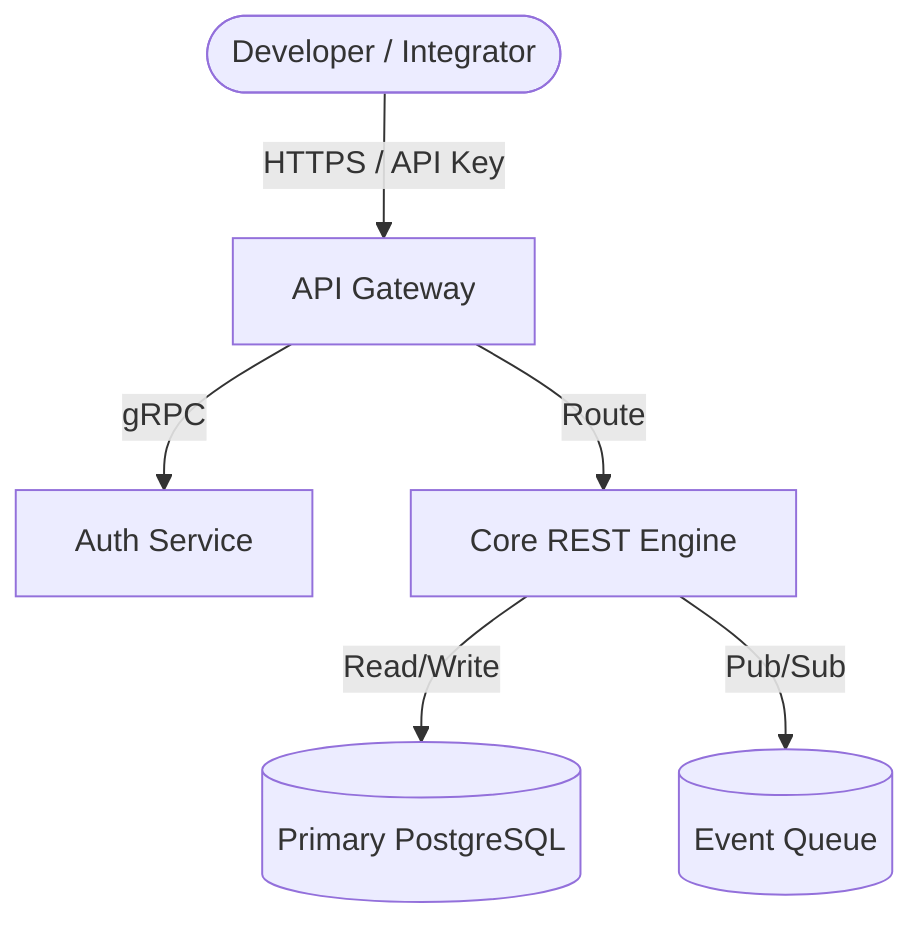

# Developer Docs Architect

`developer-docs-architect` is a deep-module agent skill for engineering, authoring, auditing, and automating enterprise-grade technical documentation suites. It operationalizes software documentation as a first-class engineering artifact ("Docs-as-Code"), bridging system architecture, API specifications, and developer experience.

See [CARD.md](CARD.md) for companion cheat sheets, CLI tool triggers, and invariant checklists.

---

## Core Operational Pillars

Every documentation engagement enforces three architectural pillars:

1. **The Visual Brief** — Interactive HTML reports generated in `%TEMP%/developer-docs-architect-<timestamp>.html` with live Mermaid.js system topology diagrams, Diátaxis quadrant mappings, and 100-point diagnostic scorecards.
2. **The Mandatory Checkpoint** — Human-in-the-loop validation via `implementation_plan.md` with `RequestFeedback: true`. The agent must halt and await user confirmation before modifying or committing documentation files.
3. **Behavioral Boundaries & Anti-Patterns** — Rigid negative guardrails that reject ungrounded prose, static PNG diagrams, bare error codes, and orphaned reference pages.

---

## Authoritative Tooling & Execution Seams

The skill provides deterministic, non-interactive execution engines in `scripts/`:

- `python scripts/doc_linter.py <target> [--json] [--max-bolding 10]`: Slotted Markdown AST linter enforcing bolding ratios (<=10%), heading sequentiality, and 6-section API endpoint anatomy.
- `python scripts/openapi_doc_sync.py --spec <spec.json> --out <dir>`: Ingests OpenAPI 3.0 specifications and synthesizes compliant Track B Markdown references.

Consult co-located architectural reference guides in `references/`:
- [`diataxis-taxonomy-guide.md`](references/diataxis-taxonomy-guide.md): 4-quadrant taxonomy criteria and anti-conflation rules.
- [`c4-mermaid-blueprints.md`](references/c4-mermaid-blueprints.md): Context, Container, and Component diagram patterns with translation tables.
- [`api-endpoint-anatomy-guide.md`](references/api-endpoint-anatomy-guide.md): The 6-section API anatomy and actionable error catalog taxonomy.

---

## The Diátaxis 4-Quadrant Taxonomy

All technical documentation must map unambiguously into Daniele Procida's Diátaxis framework (see `diataxis-taxonomy-guide.md`). Never combine disparate quadrants on a single page:

| Dimension | Learning / Practical Step | Information / Conceptual View |
|---|---|---|
| **Practical Tasks** | **Tutorials** (Learning-oriented; step-by-step onboarding lesson for newcomers) | **How-To Guides** (Problem-oriented; real-world recipe solving a specific goal) |
| **Theoretical Knowledge** | **Explanation** (Understanding-oriented; architecture, context, rationale, and design trade-offs) | **Reference** (Information-oriented; authoritative endpoint specs, CLI flags, schema catalogs) |

---

## Execution Stages

### Stage 1: Intent & Taxonomy Framing

Audit existing documentation or incoming engineering requirements against the Diátaxis 4-quadrant taxonomy to identify coverage holes and audience personas.

#### Procedure
1. Identify primary reader archetypes:
   - *Internal Engineer*: Requires C4 Component diagrams, design rationale, and local setup recipes.
   - *External API Integrator*: Requires authentication contracts, quickstart tutorials, and endpoint references.
   - *DevOps / Platform Operator*: Requires deployment runbooks, healthcheck specs, and environment matrices.
2. Perform a Diátaxis gap analysis by cataloging all existing pages into a 4-quadrant coverage matrix per `diataxis-taxonomy-guide.md`.
3. Flag any conflated documents (e.g., tutorial mixed with reference specs) for structural decoupling.
4. Establish clear prerequisite chains for every planned document.

> **Completion Gate**: `Diátaxis gap analysis matrix authored with quadrant assignments and coverage identified`

---

### Stage 2: Multi-View C4 Architectural Modeling

Construct clear, multi-perspective system blueprints using Simon Brown's C4 model, authored strictly in Mermaid.js code to prevent visual drift (see `c4-mermaid-blueprints.md`).

#### Procedure
1. Author **Level 1: System Context**:
   - 10,000-foot view displaying user personas, the core system boundary, and external third-party dependencies.
2. Author **Level 2: Container Architecture**:
   - High-level runtime topology showing web frontends, API gateways, worker proactors, message queues, and storage engines with protocols.
3. Author **Level 3: Component Breakdown**:
   - Decomposition of core service containers into logical subsystems, IoC service containers, and domain modules.
4. Create a **Business Outcome Translation Table** (minimum 3 rows) translating technical architecture nodes into human and stakeholder value.
5. Enforce **Diagrams-as-Code Invariant**: Reject all binary image formats (`.png`, `.jpg`, `.svg`). Render all diagrams via fenced Mermaid.js blocks.

> **Completion Gate**: `3 C4 views authored in Mermaid.js with business translation table and zero static PNGs`

---

### Stage 3: 2-Track API & Reference Blueprinting

Structure API references along two distinct tracks: Onboarding Developer Guides (Track A) and Authoritative Technical Reference (Track B). Track B pages may be synthesized automatically using `scripts/openapi_doc_sync.py`.

#### Track A: Developer Onboarding & Quickstart (Tutorial / How-To)
- Provide a zero-to-first-request pathway in under 5 minutes.
- Supply copy-pasteable curl commands with synthetic sandbox credentials.
- Document exact environment setup, base URLs, and sandbox testing endpoints.

#### Track B: Authoritative Endpoint Reference (Reference)
Every API endpoint must implement the mandatory 6-section anatomy (see `api-endpoint-anatomy-guide.md`):
1. **Endpoint & Method**: Full URI path with HTTP verb (e.g., `POST /v1/payments/charges`).
2. **Authentication & Headers**: Security scheme (`Bearer <token>`), content negotiation headers, and idempotency keys.
3. **Request Parameters**: Strict table of Path, Query, and Header variables specifying name, type, requirement, and constraints.
4. **Request Body Example**: Validated JSON payload demonstrating realistic values, never empty `{}` stubs.
5. **Response Payloads**: Status codes (`200 OK`, `201 Created`) with corresponding slotted JSON payloads.
6. **Actionable Error Catalog**: Error table mapping HTTP status codes to explicit machine error codes, triggers, and concrete developer remediations.

> **Completion Gate**: `2-track API docs authored with full 6-section endpoint anatomy and actionable error catalog`

---

### Stage 4: 4-Pass Editorial & AI-Agent (GEO) Readiness

Apply rigorous editorial standards to eliminate cognitive drag and optimize documentation for both human engineers and AI agent retrieval. Verify programmatically with `scripts/doc_linter.py`.

#### The 4-Pass Editorial Inspection
1. **Audience Empathy Pass**: Verify all prerequisite knowledge is stated upfront; eliminate unexplained acronyms.
2. **Style & Tone Pass**: Enforce active voice and imperative mood ("Run the command", not "The command should be run").
3. **Bolding & Layout Pass**: Ensure bold emphasis does not exceed 10% of total page content to avoid visual noise (`scripts/doc_linter.py`).
4. **AI-Agent Navigation Pass**: Author machine-friendly index markers:
   - Generate `llms.txt` or `llms-full.txt` summarizing available documentation URLs and programmatic schemas.
   - Ensure clean markdown heading hierarchy (`#` -> `##` -> `###`) with zero skipped levels.
   - Guarantee each code block has an explicit language identifier (`bash`, `json`, `python`, `typescript`).

> **Completion Gate**: `4-pass editorial checklist complete with <=10% bolding and llms.txt or Mintlify score >=80%`

---

### Stage 5: Docs-as-Code Pipeline & Drift Defense

Automate documentation testing and synchronization directly inside the code repository to guarantee zero drift between production code and developer docs.

#### Procedure
1. **OpenAPI Integration & Sync**: Synchronize API reference documentation directly from OpenAPI 3.x specifications using `scripts/openapi_doc_sync.py`.
2. **Docs-as-Code CI/CD**:
   - Run `scripts/doc_linter.py` in CI to fail builds if bolding limits are exceeded, heading levels are skipped, or endpoint anatomy is incomplete.
   - Fail CI builds if an endpoint schema is modified in source code without a corresponding documentation diff.
3. **Version & Lifecycle Management**:
   - Establish URI version prefixes (`/v1/`, `/v2/`).
   - Clearly banner deprecated endpoints with migration timelines and replacement endpoint links.

> **Completion Gate**: `Docs-as-Code pipeline verified with OpenAPI 3.x spec, Git docs repo, and CI sync workflow`

---

## Anti-Patterns

- **Wall-of-Jargon Syndrome** — Describing systems through backend buzzwords without a user-facing outcome translation table.
- **Static Image Rot** — Exporting diagrams as PNG/SVG from presentation tools, causing silent drift on service renames.
- **Generic Error Dumping** — Listing bare HTTP status codes without specific error payloads, root-cause triggers, or remediation steps.
- **Taxonomic Conflation** — Mixing step-by-step tutorial objectives, conceptual architecture explanations, and reference lookup in a single page.
- **Context-Orphaned Pages** — Omitting prerequisites, dependencies, and environment requirements from pages, breaking human and AI retrieval.
- **Drift Abandonment** — Publishing documentation to standalone wikis or CMS platforms disconnected from source code pull requests.
