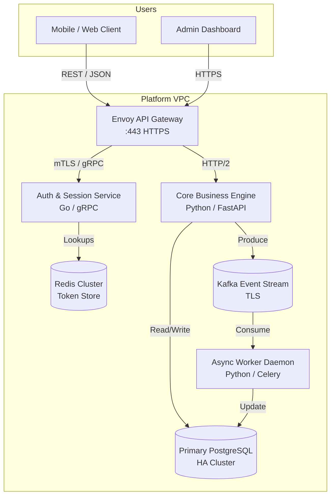
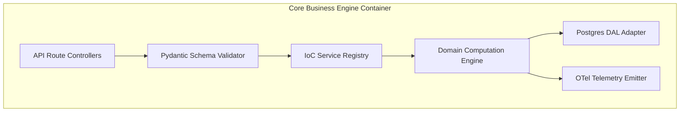

# C4 Multi-Perspective Architecture Blueprints (Mermaid.js)

Simon Brown's C4 model provides a hierarchical zoom-in mechanism for software systems:
- **Level 1: System Context** (10,000-ft view, users, systems, boundary)
- **Level 2: Container** (Apps, services, data stores, protocols)
- **Level 3: Component** (Subsystems, modules, IoC services inside containers)
- **Level 4: Code** (Classes, methods — optional / AST auto-generated)

---

## Level 1: System Context Blueprint

```mermaid
flowchart TD
    Customer([External Developer]) -->|HTTPS / REST API| SystemBoundary[Payment Gateway Core]
    Staff([Support Specialist]) -->|Web Admin Portal| SystemBoundary
    
    SystemBoundary -->|gRPC / TLS| IdentityProvider[(Enterprise IdP)]
    SystemBoundary -->|ISO 8583| CardNetwork[(Card Processing Network)]
    SystemBoundary -->|Webhook JSON| NotificationService[(SMS / Email Provider)]
    
    style SystemBoundary fill:#1e1b4b,stroke:#6366f1,stroke-width:2px
```

---

## Level 2: Container Blueprint

---

## Level 3: Component Blueprint

---

## Business Outcome Translation Table

Every architecture diagram must include a translation table mapping engineering nodes to stakeholder outcomes:

| Architectural Component | Engineering Characteristic | Stakeholder / Business Outcome |
|---|---|---|
| **Redis Cache Cluster** | In-memory key-value cache with <5ms p99 latency | Instant token balance check preventing cart abandonment |
| **Kafka Event Stream** | Append-only partitioned distributed log | Guaranteed zero data loss during high-concurrency flash sales |
| **Envoy API Gateway** | Rate limiting, token bucket, and TLS termination | Protection against credential stuffing and DDoS disruptions |
| **PostgreSQL HA Replica** | Multi-AZ active-passive replication with automated failover | Continuous 99.99% availability during cloud availability zone incidents |
