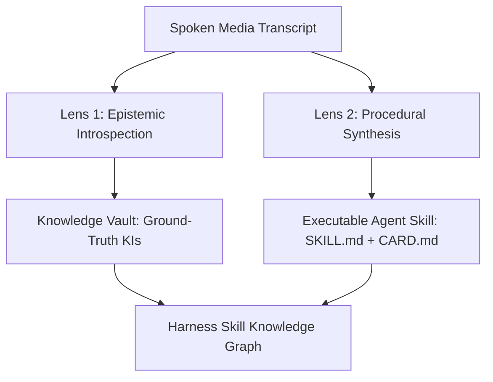

# Media Mind Forge: Cognitive Introspection & Skill Synthesis

`media-mind-forge` is the authoritative multi-modal learning engine for Brain Harness. It unifies the procedural methodology extraction of `book-to-skill-forge` with the epistemic introspection and isnad provenance tracking of `mind-reader` to transform spoken media, recorded lectures, and video transcripts into durable Knowledge Items (KIs) and executable agent skills (`SKILL.md` + `CARD.md`).

Every media forging session adheres to three foundational pillars:
1. **The Visual Brief** — Interactive HTML reports generated in `%TEMP%` featuring Mermaid cognitive topology diagrams.
2. **The Mandatory Checkpoint** — Explicit human-in-the-loop gates (`RequestFeedback: true`) before committing synthesized skills or mutating knowledge stores.
3. **Explicit Anti-Patterns** — Rigid behavioral boundaries eliminating superficial summaries, speculative over-commitment, and ungrounded claims.

See [CARD.md](CARD.md) for the companion summary card, stage matrix, and invariants checklist.

---

## Semantic Intent Descriptors & Routing Triggers

The Agent Skill Knowledge Graph routes tasks to this skill when any of the following triggers or conceptual intents are detected:
- **Primary Triggers**: `"analyze video transcript"`, `"learn from video"`, `"distill lecture"`, `"forge skill from transcript"`, `"media mind forge"`
- **Downstream Operations**: `"extract mental models from video"`, `"create knowledge items from lecture"`, `"transcribe and learn"`, `"synthesize coaching rubric from video"`
- **Topological Successor To**: `youtube-transcript-fetcher`, `stagehand_browser`, `web_fetcher`
- **Topological Predecessor To**: `skill_knowledge_graph`, `hermes_state_fts5`, `epistemic-memory-lifecycle`

---

## The Dual-Lens Cognitive Extraction Model

```
┌─────────────────────────────────────────────────────────────────────────┐
│                      MEDIA MIND FORGE DUAL-LENS ENGINE                  │
├────────────────────────────────────┬────────────────────────────────────┤
│ Lens 1: Mind-Reader Introspection  │ Lens 2: Procedural Skill Forge     │
│ - First Principles & Mental Models │ - Shu-Ha-Ri Execution Stages      │
│ - Decision Heuristics & Trade-offs │ - Diagnostic Coaching Questions    │
│ - Epistemic Isnad Lineage Blocks   │ - Anti-Pattern Defense Matrices    │
│ - Knowledge Items (KIs) to Vault   │ - Executable SKILL.md & CARD.md    │
└────────────────────────────────────┴────────────────────────────────────┘
```

---

## Execution Sequence

### Stage 1: Ingest & Deconstruct Transcript
Ingest raw transcript text, timestamped segment arrays, or fetch live via `youtube-transcript-fetcher`. Normalize formatting, compute speaking pace and total duration, and isolate core procedural sections from conversational filler.

> **Completion criterion**: Verified transcript text and timestamped segments parsed with word count and duration recorded.

---

### Stage 2: Dual-Lens Extraction & Epistemic Isnad Binding
Execute simultaneous Mind-Reader and Forge analysis:
1. **Epistemic Distillation (Mind-Reader)**: Unpack foundational axioms, decision heuristics, and delta learnings. Bind every claim to exact transcript timestamps (`isnad_claims`).
2. **Procedural Synthesis (Forge)**: Formulate 3 to 6 operational stages with deterministic completion gates and author diagnostic interview scorecards.

> **Completion criterion**: Mental models, heuristics, procedural stages, diagnostic rubric, and Knowledge Items formulated.

---

### Stage 3: The Visual Synthesis Brief
Generate an interactive, self-contained HTML report at `%TEMP%/media-mind-forge-<timestamp>.html` rendering a Mermaid Cognitive Topology DAG connecting first principles to decision trade-offs and operational stages.



> **Completion criterion**: Self-contained HTML report generated in `%TEMP%` and presented with clickable link.

---

### Stage 4: Mandatory Checkpoint Gate
Author an `implementation_plan.md` artifact with `RequestFeedback: true` detailing proposed Knowledge Items, skill name, and target directory. STOP and await explicit user approval before writing files to persistent stores.

> **Completion criterion**: Explicit user confirmation received before committing artifacts.

---

### Stage 5: Artifact Scaffolding & Knowledge Vault Commit
Write the validated `SKILL.md` and `CARD.md` into the target skill directory (enforcing single-pipe `│` borders and standard anti-patterns heading per Rule 37). Persist extracted Knowledge Items to storage and register in the Skill Knowledge Graph.

> **Completion criterion**: Validated skill package authored and Knowledge Items indexed with 100% test pass rate.

---

## Anti-Patterns

- **Superficial Narrative Summarization** — Paraphrasing transcript dialogue into passive summaries without extracting operational algorithms or mental models. Always extract checkable Shu-Ha-Ri execution stages and first-principle heuristics.
- **Ungrounded Isnad Claims** — Asserting axioms or authoritative advice without citing supporting transcript quotes or video timestamps. Always bind claims to timestamped isnad nodes.
- **Speculative Tool Sprawl** — Creating fragmented single-purpose scripts for each video instead of modular, reusable skill architectures. Deepen existing skills in-place or generate standardized deep-module packages.
