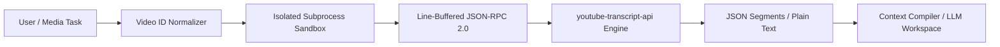

# YouTube Transcript Fetcher

`youtube-transcript-fetcher` is a native Brain-Harness execution skill that extracts complete spoken transcripts, timestamped subtitle segments, and video dialogue from YouTube video URLs or 11-character video IDs. The engine executes inside a dedicated, isolated subprocess sandbox (`plugin.youtube_transcript_fetcher`), communicating over line-buffered JSON-RPC 2.0 standard I/O streams.

Every execution follows three foundational pillars:
1. **The Visual Brief** — Interactive HTML reports generated in `%TEMP%` featuring Mermaid data-flow topologies.
2. **The Mandatory Checkpoint** — Human-in-the-loop gate (`RequestFeedback: true`) prior to executing large playlist batches or high-volume downstream summarizations.
3. **Explicit Anti-Patterns** — Rigid behavioral boundaries preventing hallucinated URLs, unhandled caption disablements, and unbounded context blowout.

See [CARD.md](CARD.md) for the companion summary card, schema tables, and mandatory completion checklist.

---

## Semantic Intent Descriptors & Routing Triggers

The Agent Skill Knowledge Graph routes tasks to this skill when any of the following triggers or conceptual intents are detected:
- **Primary Triggers**: `"youtube transcript"`, `"fetch youtube captions"`, `"ingest youtube video"`, `"get video subtitles"`, `"youtube speech to text"`
- **Downstream Operations**: `"summarize youtube video"`, `"extract dialogue from video"`, `"youtube video audio text"`, `"transcribe youtube url"`
- **Topological Predecessor To**: `prompt_pruning_layer`, `context_compiler`, `data-topology-mapper`

---

## Input & Output Schema Specifications

### Input Schema
| Parameter | Type | Required | Default | Description |
|---|---|---|---|---|
| `video_url` | `string` | No* | `""` | Target YouTube URL (watch, shortened, embed, shorts, or live stream). |
| `video_id` | `string` | No* | `""` | Canonical 11-character YouTube video ID (e.g. `dQw4w9WgXcQ`). |
| `languages` | `list[str]` | No | `["en"]` | Priority list of ISO 639-1 language codes to attempt. |
| `format` | `string` | No | `"json"` | Output format: `"json"` (timed segments list) or `"text"` (plain string). |
| `preserve_formatting`| `boolean` | No | `false` | Whether to preserve HTML formatting tags (`<i>`, `<b>`) in caption segments. |

*\* Note: Either `video_url` or `video_id` must be provided.*

### Output Schema (Success)
```json
{
  "status": "ok",
  "video_id": "dQw4w9WgXcQ",
  "format": "json",
  "captions_available": true,
  "segment_count": 42,
  "transcript": [
    {
      "text": "We're no strangers to love",
      "start": 18.5,
      "duration": 3.2
    }
  ],
  "raw_text": "We're no strangers to love You know the rules and so do I..."
}
```

### Output Schema (Captions Disabled / Video Unavailable)
```json
{
  "status": "error",
  "error": "Captions and transcripts are disabled for video 'dQw4w9WgXcQ'.",
  "error_code": "TRANSCRIPTS_DISABLED",
  "video_id": "dQw4w9WgXcQ",
  "captions_available": false
}
```

---

## Execution Sequence

### Stage 1: URL & Video ID Normalization
Parse input parameters (`video_url` or `video_id`) using canonical regex pattern matching (`(?:v=|\/|youtu\.be\/|embed\/|shorts\/)([a-zA-Z0-9_-]{11})`). Validate that a valid 11-character video ID is isolated before issuing any network requests.

> **Completion criterion**: Verified 11-character video ID extracted without ambiguity.

---

### Stage 2: Subprocess Sandbox Dispatch & Availability Probe
Dispatch JSON-RPC request to `plugin.youtube_transcript_fetcher` across the standard I/O pipe transport. Query `list_transcripts` or `fetch_transcript` to evaluate whether manual or auto-generated captions exist.

> **Completion criterion**: Successful JSON-RPC handshake with the subprocess sandbox.

---

### Stage 3: The Visual Brief
For media audits or multi-video ingestion pipelines, generate a self-contained HTML report at `%TEMP%/youtube-transcript-review-<timestamp>.html` rendering a Mermaid sequence diagram showing the extraction topology, language availability, and segment token counts.



> **Completion criterion**: Self-contained HTML report generated in `%TEMP%` and referenced.

---

### Stage 4: Mandatory Checkpoint Gate
When processing video playlists, transcripts exceeding 20,000 words, or triggering high-volume downstream LLM summarization, author an `implementation_plan.md` artifact with `RequestFeedback: true`. STOP and await explicit user approval before mutating workspace files.

> **Completion criterion**: Explicit user confirmation received before heavy memory ingestion.

---

### Stage 5: Transcript Ingestion & Token Optimization
Retrieve the full transcript text or timed segment array. If the transcript length exceeds LLM token limits, apply deterministic middle-out pruning or chunking before appending into the agent conversation context.

> **Completion criterion**: Clean, verified transcript structured into workspace target or memory.

---

### Stage 6: Recording & Walkthrough
Record completed extraction metrics (total words, segment count, video ID, execution latency) in `walkthrough.md` with clickable links to generated transcript summaries or artifacts.

> **Completion criterion**: Comprehensive walkthrough artifact finalized and linked.

---

## Anti-Patterns

- **Bare URL Hallucination** — Invoking LLM generation with speculative video content without fetching the ground-truth transcript. Always verify video ID and fetch ground-truth transcript.
- **Unhandled Disabled Captions** — Crashing on TranscriptsDisabled or propagating unhandled tracebacks to the user. Always trap TranscriptsDisabled and report captions_available: false.
- **Massive Memory Dumps** — Dumping raw 100,000+ word transcripts directly into chat context. Apply progressive tabular summarization and write full transcripts to disk artifacts.
