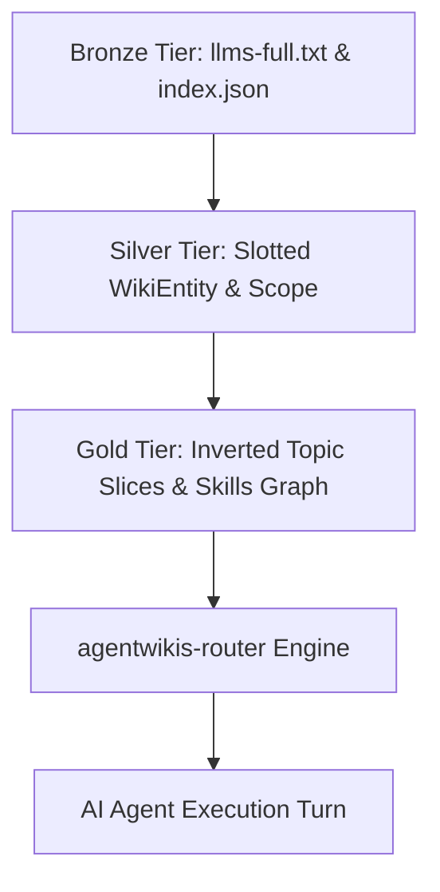

# AgentWikis Corpus Architecture, Trust Semantics & Data Governance

## Epistemic Introspection & Core Mental Models

`AgentWikis` operationalizes developer documentation and framework guides as a structured knowledge substrate for AI agents. Rather than treating technical documentation as unstructured web pages, it introduces three foundational trust semantics:

1. **Declared Scope Boundaries (`scope.covers` vs `scope.notCovered`)**:
   - Every knowledge base explicitly bounds its domain.
   - When user questions trigger concepts declared in `notCovered`, agents must immediately abstain rather than hallucinating or extrapolating.
2. **Calibrated Abstention (~94% Correct Abstention)**:
   - Search results compute an empirical confidence metric (`calibrated_confident`).
   - A `false` value signals the wiki likely lacks the answer, triggering automatic fallback to live web search.
3. **Provable Ingestion & Citable Provenance**:
   - Documents are tracked via YAML frontmatter with update timestamps and upstream software versions (`currentAs`).
   - Responses cite source wiki paths in the reference footer.

## Hybrid Data Topology & Medallion Lakehouse Mapping

- **Bronze Tier**: Raw full-text corpus (`AgentWikis-llms-full.txt`, 10.2 MB) containing 62 wikis demarcated by `<!-- ===== <slug>/<path> ===== -->`.
- **Silver Tier**: Normalized, strongly-typed slotted entities (`WikiEntity`, `WikiScope`, `SkillEntity`) enforcing `Rule 12` immutability.
- **Gold Tier**: Topic-sliced markdown sections, inverted search index, and calibrated confidence metrics.

## DAMA-DMBOK 6-Dimension Quality Assurance

The corpus is continuously audited against 6 data quality dimensions:
- **Accuracy**: Valid slug format and URI schema verification.
- **Completeness**: Compulsory presence of title, description, category, and scope.
- **Consistency**: Relational integrity between skills and referenced parent wikis.
- **Timeliness**: Freshness audits tracking `currentAs` and `lastUpdated` within 24 months.
- **Validity**: Date parsing and YAML frontmatter validation.
- **Uniqueness**: Collision prevention on slug keys and document paths.

## Anti-Pattern Defenses

- **Context Flooding Monolith**: Bounded by Tier 3 on-demand local slice extraction rather than prompt-dumping the 10MB file.
- **Hallucinatory Extrapolation**: Deflected by hard negative boundary gates on `scope.notCovered`.
- **Silent Scope Bypassing**: Defended by inspecting `currentAs` version metadata against the target software environment.
