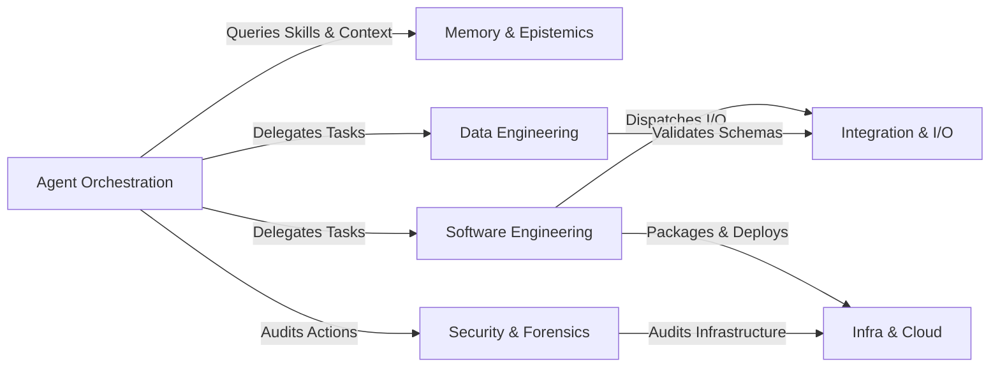

# Context Map: Brain Harness Ecosystem

This context map defines the bounded domains for the Brain Harness ecosystem, partitioning all optional plugins, services, and cognitive capabilities into seven cohesive domain contexts.

---

## Bounded Domains

### 1. [Agent Orchestration](./docs/domains/agent-orchestration/CONTEXT.md)
* **Scope**: Multi-agent consensus, hierarchical task decomposition, adversarial debate, critic evaluation, and human-in-the-loop governance.
* **Member Plugins**:
  - `agent_supervisor` — Multi-agent delegation, wave coordination, and quorum consensus.
  - `agent_debater` — Dialectical / Chavruta adversarial debate between generator and critic nodes.
  - `evaluator_critic` — Structured criteria evaluation and quality scoring.
  - `task_planner` — Hierarchical DAG task decomposition and dependency sequencing.
  - `human_in_the_loop` — Interactive checkpoints, approval gates, and escalation modals.
* **Member Skills**:
  - [`questio-reflection`](file:///.agents/skills/questio-reflection/SKILL.md) — Aquinas-style adversarial self-reflection and invariant challenge before execution.

### 2. [Memory & Epistemics](./docs/domains/memory-and-epistemics/CONTEXT.md)
* **Scope**: Declarative skill graphs, semantic embeddings, context distillation, prompt benchmarking, and claim lineage.
* **Member Plugins**:
  - `skill_knowledge_graph` — Skill network indexing, shortest-path chain synthesis, and intent routing.
  - `vector_index` — Local semantic vector indexing and hybrid BM25/cosine retrieval.
  - `embedding_cluster` — Vector clustering and dimensionality reduction.
  - `context_compactor` — Context window distillation and token-budget compression.
  - `prompt_benchmark` — Prompt efficacy benchmarking and token telemetry.
* **Member Skills**:
  - [`epistemic-isnad-audit`](file:///.agents/skills/epistemic-isnad-audit/SKILL.md) — Unbroken chain-of-custody lineage verification for facts and decisions.
  - [`mind-reader`](file:///.agents/skills/mind-reader/SKILL.md) — Introspection and heuristic extraction from attached brain trajectories.
  - [`repo-reader`](file:///.agents/skills/repo-reader/SKILL.md) — Architectural pattern and commit trajectory introspection from Git repositories.
  - [`harness-reflector`](file:///.agents/skills/harness-reflector/SKILL.md) — Autobiographical reflection and heuristic distillation from internal reports and execution logs.

### 3. [Data Engineering](./docs/domains/data-engineering/CONTEXT.md)
* **Scope**: Curated tabular ingestion, out-of-core statistical profiling, schema transformation, and relational database execution.
* **Member Plugins**:
  - `dataset_profiler` — Out-of-core moments, null ratios, and Z-score outlier detection.
  - `data_transformer` — Schema reshaping, column normalization, and type casting.
  - `database_sql` — SQL query execution, transaction handling, and schema reflection.
  - `synthetic_generator` — Synthetic tabular matrix and mock data generation.
* **Member Skills**:
  - [`structured-data-scout`](file:///.agents/skills/structured-data-scout/SKILL.md) — Curated tabular dataset ingestion from authoritative registries (UCI, Kaggle, OpenData).
  - [`survival-analysis`](file:///.agents/skills/survival-analysis/SKILL.md) — Kaplan-Meier estimation, Cox proportional hazards regression, and Schoenfeld diagnostics.
  - [`data-topology-mapper`](file:///.agents/skills/data-topology-mapper/SKILL.md) — Causal DAG lineage mapping, queue architectures, and hybrid data topologies.

### 4. [Software Engineering](./docs/domains/software-engineering/CONTEXT.md)
* **Scope**: AST code refactoring, architecture invariant linting, sandbox script execution, git operations, and artifact reporting.
* **Member Plugins**:
  - `refactor_engine` — AST-aware code transformation and import hygiene.
  - `arch_linter` — Architecture boundary checking and cyclic dependency linting.
  - `code_runner` — Isolated script execution and exit code assertions.
  - `filesystem_git` — Git version control, branching, diffs, and staging.
  - `migration_assistant` — Version migrations and compatibility cutovers.
  - `artifact_generator` — Markdown summaries, visual brief generation, and diff reports.
* **Member Skills**:
  - [`crafting-skills`](file:///.agents/skills/crafting-skills/SKILL.md) — High-precision agent skill authoring, refactoring, and companion card generation.
  - [`deepen-architecture`](file:///.agents/skills/deepen-architecture/SKILL.md) — Iterative architecture deepening loop, eliminating shallow modules.
  - [`compute-model-assessor`](file:///.agents/skills/compute-model-assessor/SKILL.md) — Model routing, task complexity assessment, and reasoning compute budgeting.

### 5. [Security & Forensics](./docs/domains/security-and-forensics/CONTEXT.md)
* **Scope**: Threat modeling, vulnerability scanning, log forensics, network port auditing, and execution trajectory auditing.
* **Member Plugins**:
  - `security_scanner` — Vulnerability detection and secret leakage analysis.
  - `threat_modeler` — STRIDE threat modeling and attack tree formulation.
  - `log_forensics` — Structured log pattern extraction and anomaly hunting.
  - `network_forensics` — Port security audit and network connectivity verification.
  - `trajectory_auditor` — Execution step replay and invariant trajectory verification.
* **Member Skills**:
  - *(Inherits platform audit workflows; domain skills scaffolded on demand)*

### 6. [Infrastructure & Cloud Operations](./docs/domains/infra-and-cloud/CONTEXT.md)
* **Scope**: Container management, Kubernetes manifest validation, Infrastructure-as-Code (IaC), and CI/CD pipelines.
* **Member Plugins**:
  - `docker_container` — Container lifecycle, build, run, and port binding.
  - `k8s_manifest` — Kubernetes YAML schema validation and resource scaffolding.
  - `terraform_iac` — Terraform HCL syntax validation and plan checking.
  - `ci_pipeline` — CI/CD pipeline definition and automated workflow validation.
* **Member Skills**:
  - *(Inherits infrastructure tooling; domain skills scaffolded on demand)*

### 7. [Integration & I/O](./docs/domains/integration-and-io/CONTEXT.md)
* **Scope**: Clean web fetching, OpenAPI client generation, webhook notifications, and symbolic constraint solving.
* **Member Plugins**:
  - `web_fetcher` — Markdown web scraping and HTTP JSON requests.
  - `api_openapi` — OpenAPI spec ingestion and client tool synthesis.
  - `notification_webhook` — Webhook broadcasting and alert dispatch.
  - `symbolic_solver` — Z3 theorem proving and constraint satisfaction.
* **Member Skills**:
  - [`repo-to-plugin-forge`](file:///.agents/skills/repo-to-plugin-forge/SKILL.md) — Autonomous synthesis and scaffolding of Harness plugins from attached codebases.
  - [`book-to-skill-forge`](file:///.agents/skills/book-to-skill-forge/SKILL.md) — Synthesis and authoring of deep-module agent skills and coaching rubrics from books, articles, and video transcripts.

---

## Cross-Domain Relationships

* **Agent Orchestration $\rightarrow$ Memory & Epistemics**: Agents query the `skill_knowledge_graph` and `vector_index` to route intent and retrieve relevant execution chains before decomposing tasks.
* **Agent Orchestration $\rightarrow$ Security & Forensics**: Destructive or mutating operations trigger `trajectory_auditor` and `human_in_the_loop` before committing to state.
* **Software Engineering $\rightarrow$ Infra & Cloud**: Refactored codebases and schemas hand off to `docker_container`, `k8s_manifest`, and `ci_pipeline` for containerization and delivery.
