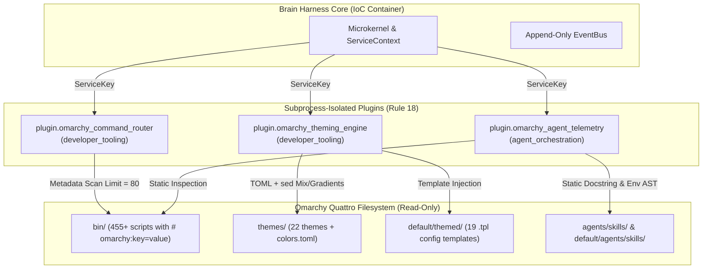

# Explanation: Omarchy Quattro Bridge Architecture & Design Decisions

This document details the architectural rationale, design trade-offs, and computational models behind the Brain Harness Omarchy Quattro Bridge.

---

## 1. System Overview & The Agentic Linux Distribution

Omarchy Quattro (v4.0.0.alpha) represents David Heinemeier Hansson's (DHH) vision of an "agentic Linux distribution": an Arch Linux-based workstation environment where AI agents (Claude Code, OpenAI Codex, Fireworks AI) are native operating system peers alongside traditional POSIX utilities and Wayland desktop components.

Rather than treating the OS as an opaque virtual machine, Omarchy exposes its configuration, themes, audio, networking, and application launchers through 455+ modular executable scripts in `bin/`.

---

## 2. Architectural Design Decisions

### A. Decentralized Metadata vs. Centralized Dispatchers

Traditional multi-command CLI utilities (such as Git or AWS CLI) frequently rely on centralized dispatch tables. Omarchy deliberately rejects this in favor of decentralized metadata headers:
- Each command is a standalone executable file in `bin/omarchy-<group>-<action>`.
- The top 80 lines declare identity via `# omarchy:key=value`.
- Adding, deprecating, or modifying a command requires touching exactly one file.

The `omarchy_command_router` plugin respects this design by lazily building an in-memory index from `bin/` with a fast regex scanner, caching the DAG in memory for subsequent sub-millisecond lookup.

### B. Domain Partitioning (Harness Rule 18)

Per Harness Rule 18 (*Domain-Partitioned Plugin Synthesis*), foreign codebases must never be bundled into a single monolithic plugin. The 1,826 files of Omarchy Quattro span distinct domains:
1. **Command Routing**: Developer tooling for command introspection and argument validation.
2. **Theming & Templating**: Developer tooling for color science, palette resolution, and dotfile configuration generation.
3. **Agent Telemetry & Skills**: Agent orchestration for discovering runbooks and monitoring AI token expenditure.

Partitioning these into separate plugins ensures clean dependency boundaries, zero namespace collisions, and granular permission models.

---

## 3. Color Science & Accessibility Auditing

### Linear RGB Mixing vs. Gamma Correction

Omarchy's theme engine uses a fast linear interpolation algorithm (`mix_color`):

$$\text{channel}_{\text{mixed}} = \text{round}\left( \text{start} \times (1 - \alpha) + \text{end} \times \alpha \right)$$

While perceptual color spaces (such as Oklab or CIE L\*a\*b\*) provide more uniform perceptual transitions, Omarchy's choice of linear RGB in awk/sed ensures that theme generation requires zero external dependencies and completes instantaneously across 19 desktop templates. The Harness plugin faithfully replicates this exact rounding logic to prevent configuration drift.

### WCAG 2.1 Contrast Calculation

Accessibility compliance evaluates the relative luminance $L$ of text versus background surfaces:

$$L = 0.2126 R + 0.7152 G + 0.0722 B$$

Where each sRGB channel $c \in \{R, G, B\}$ is linearized:

$$c_{\text{linear}} = \begin{cases} \frac{c}{12.92} & \text{if } c \le 0.04045 \\ \left(\frac{c + 0.055}{1.055}\right)^{2.4} & \text{if } c > 0.04045 \end{cases}$$

The contrast ratio is then defined as:

$$\text{Contrast Ratio} = \frac{L_1 + 0.05}{L_2 + 0.05} \quad (\text{where } L_1 \ge L_2)$$

The `omarchy_validate_theme_contrast` tool validates whether a theme passes WCAG AA ($\ge 4.5:1$ for standard text, $\ge 3.0:1$ for large text) or AAA ($\ge 7.0:1$), alerting agents to unreadable desktop combinations before deployment.

---

## 4. Security & Non-Linux Host Isolation

Omarchy's usage tracking scripts (`omarchy-agent-usage-claude`, `omarchy-agent-usage-codex`, etc.) interact with Linux-specific paths (`~/.claude/projects/`, local SQLite databases, D-Bus, and PAM authentication).

Attempting to execute these scripts in Windows or CI environments would produce unhandled `OSError` and file-locking faults (`fcntl.flock`). Therefore, `omarchy_agent_telemetry` enforces **static code inspection**:
- The plugin inspects docstrings, arguments, and required API keys via AST and regex analysis.
- No shell subprocesses are spawned on the host OS.
- This guarantees safe, hermetic introspection across all operating systems.
