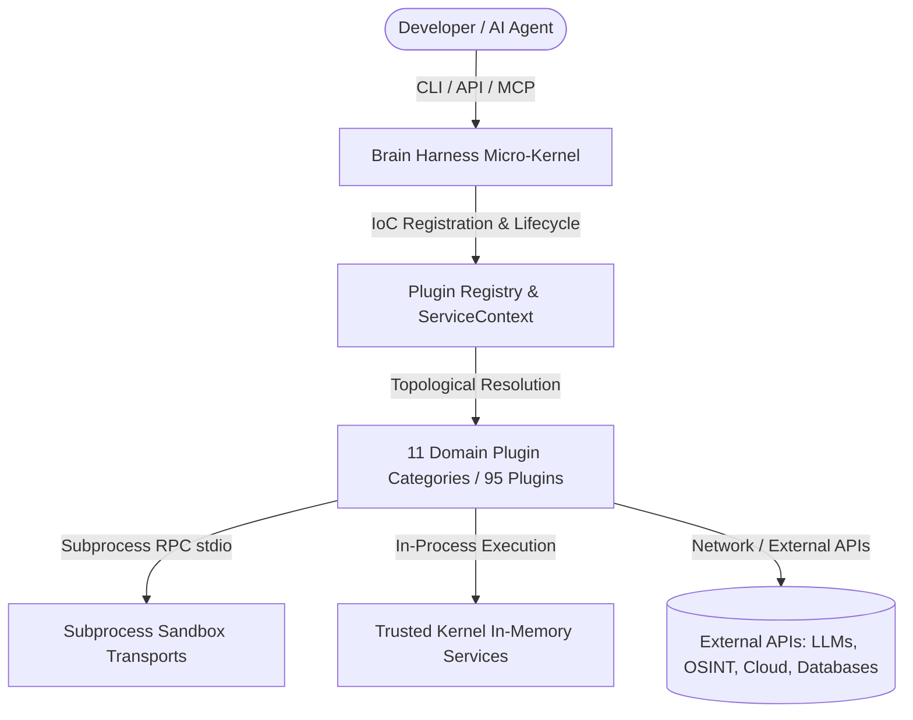
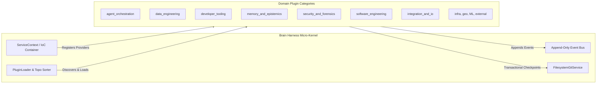

# Brain Harness — Plugin Architecture Hub

Welcome to the Brain Harness Plugin Architecture Hub. The Brain Harness micro-kernel is built entirely on the foundational principle that **everything is a plugin** (Rule 1). No functionality is hardcoded into the kernel: models, tools, storage, memory backends, and agent loops are all plugins registered into the IoC container.

---

## System Context & Container Architecture

### Level 1: System Context



### Level 2: Container Runtime Architecture



---

## Plugin Categories Directory

The plugin ecosystem is cleanly partitioned into 11 single-responsibility domain categories (Rule 18):

| Category | Plugins Count | Domain Focus | Scope Summary |
|---|---|---|---|
| [agent_orchestration](agent_orchestration/README.md) | 20 | Agent Orchestration & Multi-Agent Swarms | Multi-agent coordination loops, supervisor/worker hierarchies, debater pairs, ReAct step execution engines, tool repair, and autonomous cognitive execution workflows. |
| [data_engineering](data_engineering/README.md) | 8 | Data Engineering & High-Throughput Analytics | High-throughput array operations, DeepSelect TopK selection, compiler-style Markdown wiki generation, SQL database integrations, synthetic data generation, and dataset profiling. |
| [developer_tooling](developer_tooling/README.md) | 5 | Developer Tooling & Docs-as-Code Automation | Automated repository documentation synchronization, AST linter engines, modular CLI command routing, and developer experience theming. |
| [external](external/README.md) | 1 | External Plugins & Sandboxed Ecosystem Bridges | Subprocess-sandboxed external community plugins, third-party agent skills, and isolated Python virtual environment execution boundaries. |
| [geospatial_and_osint](geospatial_and_osint/README.md) | 3 | Geospatial Intelligence & OSINT Reconnaissance | Google Earth Engine satellite imagery processing, multi-source open-source intelligence aggregation, and planetary spatial analytics. |
| [infra_and_cloud](infra_and_cloud/README.md) | 4 | Infrastructure, Containers & Cloud Automation | Declarative CI/CD pipeline scaffolding, Docker container runtimes, Kubernetes deployment manifests, and Terraform infrastructure-as-code automation. |
| [integration_and_io](integration_and_io/README.md) | 11 | Integration, External APIs & Multi-Modal I/O | External API integrations, OpenRouter LLM gateway with Context Epoch caching, Stagehand & WebWright browser automation, AgentWikis documentation routers, and multimedia YouTube dialogue extractors. |
| [machine_learning](machine_learning/README.md) | 1 | Machine Learning & Model Post-Training | Supervised fine-tuning harnesses, post-training optimization pipelines, and model evaluation telemetry using Tunix. |
| [memory_and_epistemics](memory_and_epistemics/README.md) | 16 | Memory, Epistemics & Context Engineering | Multi-store autobiographical memory federation, OKF memory governance, Graphiti knowledge graphs, MemGraphRAG, context compactor/compiler pipelines, decay scoring, and prompt pruning layers. |
| [security_and_forensics](security_and_forensics/README.md) | 14 | Security, Forensics & Execution Policy Gates | Codex execution policies, runtime policy gates, Vibe dynamic security scanners, secret leak detection, network/log forensic analysis, and trajectory audits. |
| [software_engineering](software_engineering/README.md) | 13 | Software Engineering & Code Archaeology | Architectural linting, isolated code execution, transactional Git filesystem checkpoints, automated refactoring engines, PR lens architectural diff visualizers, and repo triad forge pipelines. |

---

## Diátaxis 4-Quadrant Architecture Mapping

| Dimension | Practical Tasks (Action) | Theoretical Knowledge (Understanding) |
|---|---|---|
| **Learning / Onboarding** | **Tutorials**<br>• *Plugin Authoring Quickstart*: Onboarding tutorial for creating, testing, and registering a new plugin.<br>• *IoC Service Registration*: Binding typed `ServiceKey[T]` to service providers. | **Explanation**<br>• *Everything is a Plugin (Rule 1)*: Micro-kernel IoC container architecture.<br>• *Subprocess Sandboxing (Rule 5 & 7)*: Lazy venv provisioning and JSON-RPC stdio transport.<br>• *Zero-Fork Config (Rule 44)*: 3-tier config hierarchy. |
| **Information / Problem Solving** | **How-To Guides**<br>• *Transactional Checkpoints (Rule 8)*: Wrapping ReAct agent actions with atomic Git rollback.<br>• *DeepSelect TopK Routing*: High-throughput array acceleration for DSA attention.<br>• *OpenRouter Gateway Routing*: Context Epoch prompt compression and model fallbacks. | **Reference**<br>• *Plugin Catalogs*: Category indexes and member plugin READMEs.<br>• *Manifest Schema*: Detailed `plugin.json` and `plugin.yaml` specifications.<br>• *AST Symbol Tables*: Live classes, methods, and entrypoints extracted via AST. |

---

## Quickstart: Creating a New Plugin

Follow this standard procedure to scaffold a new Harness plugin:

### 1. Scaffold Plugin Directory Structure
```text
plugins/<category>/<my_plugin>/
├── plugin.json          # Plugin manifest
├── config.default.yaml  # Operational budgets (timeouts, token limits)
├── main.py              # Implementation entrypoint exporting singleton `plugin`
└── README.md            # Diátaxis documentation guide
```

### 2. Define Plugin Manifest (`plugin.json`)
```json
{
  "name": "plugin.my_plugin",
  "version": "1.0.0",
  "description": "Demonstration plugin showing micro-kernel registration",
  "language": "python",
  "entrypoint": "main.py",
  "isolation": "subprocess",
  "trusted": false,
  "provides": ["my_plugin.service"],
  "requires": []
}
```

### 3. Implement Plugin Singleton (`main.py`)
```python
from harness.kernel.context import ServiceContext, ServiceKey
from harness.plugins.base import HarnessPlugin

MY_SERVICE_KEY = ServiceKey("my_plugin.service")

class MyPlugin(HarnessPlugin):
    @property
    def provides(self) -> list[ServiceKey]:
        return [MY_SERVICE_KEY]

    def on_load(self, context: ServiceContext) -> None:
        context.provide(MY_SERVICE_KEY, self)

plugin = MyPlugin()
```

---

## Core Architectural Invariants

- **Rule 1: Everything is a plugin**: Zero functionality is hardcoded in the kernel.
- **Rule 2: Typed Service Keys**: Use `ServiceKey[T]` for registration (`context.provide(key, inst)`) and resolution (`context.require(key)`).
- **Rule 5 & 7: Subprocess Isolation & Lazy Staging**: Untrusted plugins run in subprocess sandboxes with lazy venv provisioning.
- **Rule 8: Transactional Isolation**: Agent tool executions operate within atomic Git checkpoints with auto-rollback.
- **Rule 18: Domain Partitioning**: Single-responsibility plugins co-located in respective category directories.
- **Rule 44: Zero-Fork Config**: Baseline operational budgets co-located in `config.default.yaml`.
- **Rule 45: Plugin Module Singleton**: Entrypoints must export instantiated singleton `plugin = MyPlugin()`.
