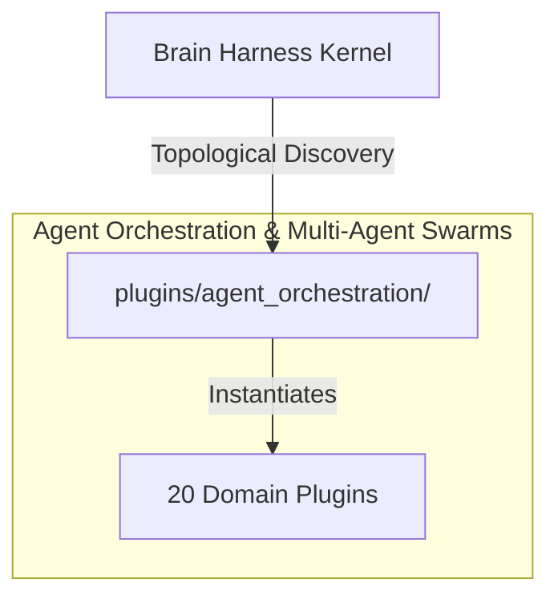

# 🤖 Agent Orchestration & Multi-Agent Swarms

Multi-agent coordination loops, supervisor/worker hierarchies, debater pairs, ReAct step execution engines, tool repair, and autonomous cognitive execution workflows.

---

## Category Architecture

Plugins within `agent_orchestration` adhere to the single-responsibility domain partitioning invariant (Rule 18). Each capability is encapsulated in a dedicated directory with independent manifests, isolation boundaries, and typed `ServiceKey[T]` declarations.

---

## Member Plugins Catalog

| Plugin | Isolation | Provided Services | Summary |
|---|---|---|---|
| [agent_debater](agent_debater/README.md) | `in_process` | `service.critic_evaluation` | Dialectical multi-agent reasoning, Proposer vs Challenger debate rounds, and arbiter verdict synthesizer |
| [agent_supervisor](agent_supervisor/README.md) | `in_process` | None | Hierarchical multi-agent supervisor, token budget allocator, and consensus voting orchestrator |
| [antigravity_core_bridge](antigravity_core_bridge/README.md) | `in_process` | `service.antigravity.connection` | Google Antigravity SDK core bridge providing LocalConnection proactor transport, streaming step ingestion, and subage... |
| [antigravity_trigger_runtime](antigravity_trigger_runtime/README.md) | `in_process` | `service.antigravity.trigger_runtime` | Google Antigravity reactive trigger scheduling engine providing async interval and file watcher wakeup without polling |
| [critic_loop](critic_loop/README.md) | `in_process` | `service.critic_evaluation`, `agent.critic_loop` | Authoritative critic, rubric evaluation, destructive command safety gate, and dialectical debate arbiter. |
| [evaluator_critic](evaluator_critic/README.md) | `in_process` | `service.critic_evaluation` | Adversarial code review, AST static analysis, destructive command safety filter, and plan feasibility critique |
| [google_adk_optimizer](google_adk_optimizer/README.md) | `subprocess` | `service.google_adk_optimizer` | Google ADK GEPA (Generative Prompt Optimization) and multi-turn scenario evaluation engine. |
| [google_adk_runtime](google_adk_runtime/README.md) | `subprocess` | `service.google_adk_runtime` | Google Agent Development Kit (ADK) runtime orchestration, session tracking, checkpoint rewind, and dynamic skill regi... |
| [hermes_cognitive_engine](hermes_cognitive_engine/README.md) | `in_process` | `service.hermes_cognitive_engine` | Hermes closed learning loop, autonomous skill formation, verification evidence evaluator, and think stream scrubber |
| [hermes_cron_scheduler](hermes_cron_scheduler/README.md) | `in_process` | `service.hermes_cron_scheduler` | Hermes unattended natural language cron scheduler, incident classification, and blueprint catalog manager |
| [hermes_gateway_relay](hermes_gateway_relay/README.md) | `in_process` | `service.hermes_gateway_relay` | Hermes multi-platform gateway relay, WebSocket telemetry streamer, and scale-to-zero lifecycle manager |
| [human_in_the_loop](human_in_the_loop/README.md) | `in_process` | None | Human-in-the-loop permission escalation gate, decision checkpoints, and approval audit ledger |
| [kimi_transcript](kimi_transcript/README.md) | `in_process` | None | Isomorphic 4-layer transcript data engine with granularity-gated telemetry filtering and 4-tier DI scope hierarchy in... |
| [loop_engine](loop_engine/README.md) | `subprocess` | None | Goal-directed agent loop state machine with tri-state resource polling, decision fixtures, stepwise control, and chec... |
| [omarchy_agent_telemetry](omarchy_agent_telemetry/README.md) | `subprocess` | `service.omarchy_agent_telemetry` | Omarchy Quattro agent skill catalog navigator and usage telemetry script introspection engine. |
| [openclaw_a2a](openclaw_a2a/README.md) | `in_process` | None | A2A v1.0 Agent-to-Agent protocol adapter for cross-host swarm federation, task delegation, and distributed observatio... |
| [openclaw_gateway](openclaw_gateway/README.md) | `in_process` | None | WebSocket JSON-RPC gateway bridge connecting Harness agents to OpenClaw control plane, session placement, and channel... |
| [openclaw_tool_repair](openclaw_tool_repair/README.md) | `in_process` | None | In-flight stream normalization and plain-text tool-call recovery engine for repairing malformed LLM tool invocations. |
| [semantic_kernel_engine](semantic_kernel_engine/README.md) | `subprocess` | None | Microsoft Semantic Kernel orchestration engine: multi-agent group chats, step-based kernel processes, dynamic prompt ... |
| [task_planner](task_planner/README.md) | `in_process` | None | Hierarchical Directed Acyclic Graph (DAG) goal decomposition and milestone dependency tracker |

---

## Invariants & Execution Boundaries

1. Domain Partitioning (Rule 18): Plugins in `agent_orchestration` do not mix cross-domain concerns.
2. Typed Service Registration (Rule 2): All services register using typed `ServiceKey[T]` contracts.
3. Subprocess Isolation (Rule 5 & 7): Untrusted and heavy external dependencies execute in isolated subprocess sandboxes with lazy venv provisioning.
4. Zero-Fork Config (Rule 44): Baseline operational budgets reside in co-located `config.default.yaml`.
