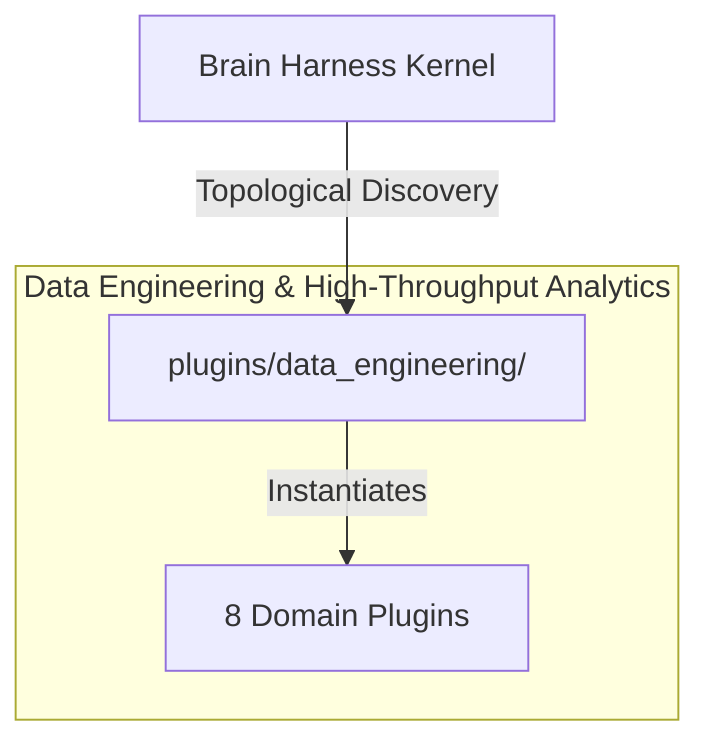

# ⚡ Data Engineering & High-Throughput Analytics

High-throughput array operations, DeepSelect TopK selection, compiler-style Markdown wiki generation, SQL database integrations, synthetic data generation, and dataset profiling.

---

## Category Architecture

Plugins within `data_engineering` adhere to the single-responsibility domain partitioning invariant (Rule 18). Each capability is encapsulated in a dedicated directory with independent manifests, isolation boundaries, and typed `ServiceKey[T]` declarations.

---

## Member Plugins Catalog

| Plugin | Isolation | Provided Services | Summary |
|---|---|---|---|
| [antigravity_otel_telemetry](antigravity_otel_telemetry/README.md) | `in_process` | `service.antigravity.telemetry` | Google Antigravity OpenTelemetry distributed trace exporter and dynamic CLI statusline IPC metric generator |
| [data_transformer](data_transformer/README.md) | `in_process` | None | Multi-format data converter (JSON ↔ CSV ↔ YAML ↔ TOML), tabular filter, and statistical profiler |
| [database_sql](database_sql/README.md) | `in_process` | None | Universal SQL database schema inspector, query runner, and execution plan explainer |
| [dataset_profiler](dataset_profiler/README.md) | `in_process` | None | Tabular statistical profiling, outlier detection (Z-score), and correlation matrix calculator |
| [deepselect_topk](deepselect_topk/README.md) | `subprocess` | `deepselect.topk.service` | DeepSelect High-Performance TopK Selection & DSA Routing Plugin with Monotonic Threshold Compaction and Hardware Cont... |
| [kimi_minidb](kimi_minidb/README.md) | `in_process` | None | Zero-dependency embedded hybrid KV and document database with CRC32-checksummed write-ahead logging (WAL) and generat... |
| [synthetic_generator](synthetic_generator/README.md) | `in_process` | None | Schema-constrained synthetic mock dataset and time-series generator |
| [wiki_compiler](wiki_compiler/README.md) | `subprocess` | None | Compiler-style dual in-memory / disk wiki builder with topological graph queries, incremental dirty-diff writing, and... |

---

## Invariants & Execution Boundaries

1. Domain Partitioning (Rule 18): Plugins in `data_engineering` do not mix cross-domain concerns.
2. Typed Service Registration (Rule 2): All services register using typed `ServiceKey[T]` contracts.
3. Subprocess Isolation (Rule 5 & 7): Untrusted and heavy external dependencies execute in isolated subprocess sandboxes with lazy venv provisioning.
4. Zero-Fork Config (Rule 44): Baseline operational budgets reside in co-located `config.default.yaml`.
