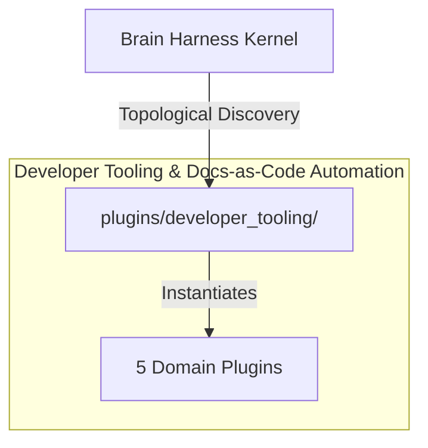

# 🛠️ Developer Tooling & Docs-as-Code Automation

Automated repository documentation synchronization, AST linter engines, modular CLI command routing, and developer experience theming.

---

## Category Architecture

Plugins within `developer_tooling` adhere to the single-responsibility domain partitioning invariant (Rule 18). Each capability is encapsulated in a dedicated directory with independent manifests, isolation boundaries, and typed `ServiceKey[T]` declarations.

---

## Member Plugins Catalog

| Plugin | Isolation | Provided Services | Summary |
|---|---|---|---|
| [doc_synchronizer](doc_synchronizer/README.md) | `in_process` | `service.doc_synchronizer` | Repository documentation coverage auditing, AST code-to-doc symbol drift verification, Diataxis scaffolding, and inte... |
| [google_adk_docs_navigator](google_adk_docs_navigator/README.md) | `subprocess` | `service.google_adk_docs_navigator` | Google ADK documentation, API reference retriever (Python/TS/Go/Kotlin), and llms.txt index navigator. |
| [google_adk_web_bridge](google_adk_web_bridge/README.md) | `subprocess` | `service.google_adk_web_bridge` | Google ADK Web UI bridge: Angular visualization status, execution DAG export (A2UI / ngx-vflow format), and dev serve... |
| [omarchy_command_router](omarchy_command_router/README.md) | `subprocess` | `service.omarchy_command_router` | Introspects and queries Omarchy Quattro's 455 modular CLI commands, routing architecture, and metadata headers. |
| [omarchy_theming_engine](omarchy_theming_engine/README.md) | `subprocess` | `service.omarchy_theming_engine` | Omarchy Quattro theming engine, palette resolution, sed-compatible template renderer, and WCAG contrast analyzer. |

---

## Invariants & Execution Boundaries

1. Domain Partitioning (Rule 18): Plugins in `developer_tooling` do not mix cross-domain concerns.
2. Typed Service Registration (Rule 2): All services register using typed `ServiceKey[T]` contracts.
3. Subprocess Isolation (Rule 5 & 7): Untrusted and heavy external dependencies execute in isolated subprocess sandboxes with lazy venv provisioning.
4. Zero-Fork Config (Rule 44): Baseline operational budgets reside in co-located `config.default.yaml`.
