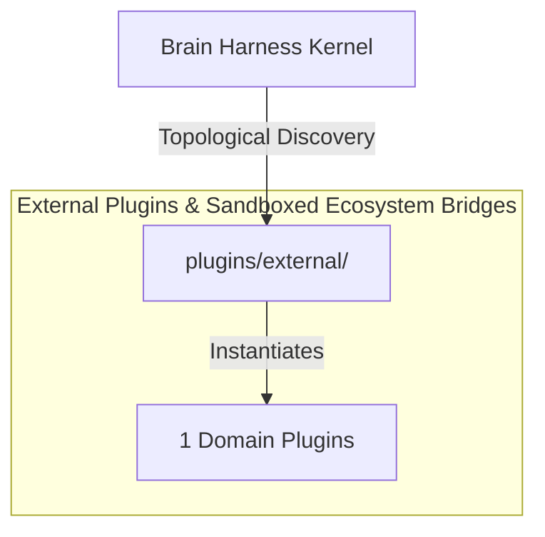

# 🌐 External Plugins & Sandboxed Ecosystem Bridges

Subprocess-sandboxed external community plugins, third-party agent skills, and isolated Python virtual environment execution boundaries.

---

## Category Architecture

Plugins within `external` adhere to the single-responsibility domain partitioning invariant (Rule 18). Each capability is encapsulated in a dedicated directory with independent manifests, isolation boundaries, and typed `ServiceKey[T]` declarations.

---

## Member Plugins Catalog

| Plugin | Isolation | Provided Services | Summary |
|---|---|---|---|
| [Pocock-skills-main](Pocock-skills-main/README.md) | `subprocess` | None | Matt Pocock's agent skills for real engineering — grilling, spec/ticket flows, TDD, code review, domain modelling and... |

---

## Invariants & Execution Boundaries

1. Domain Partitioning (Rule 18): Plugins in `external` do not mix cross-domain concerns.
2. Typed Service Registration (Rule 2): All services register using typed `ServiceKey[T]` contracts.
3. Subprocess Isolation (Rule 5 & 7): Untrusted and heavy external dependencies execute in isolated subprocess sandboxes with lazy venv provisioning.
4. Zero-Fork Config (Rule 44): Baseline operational budgets reside in co-located `config.default.yaml`.
