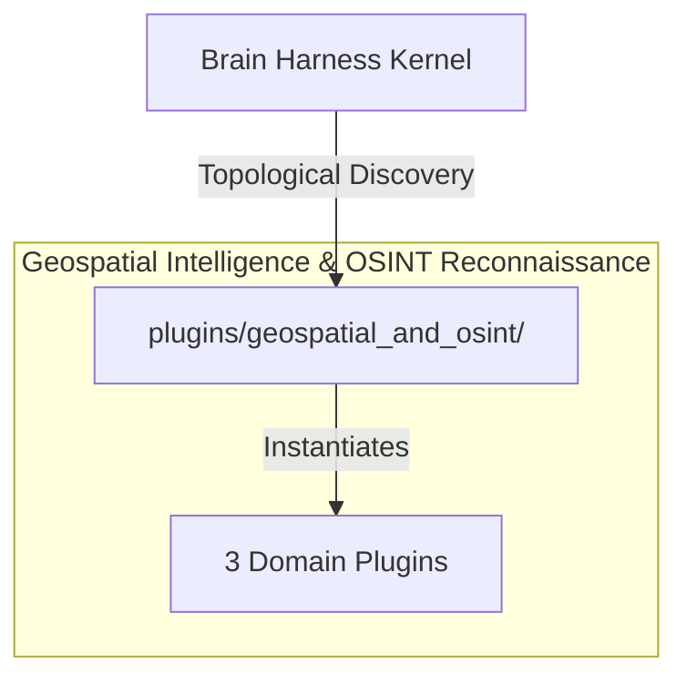

# 🛰️ Geospatial Intelligence & OSINT Reconnaissance

Google Earth Engine satellite imagery processing, multi-source open-source intelligence aggregation, and planetary spatial analytics.

---

## Category Architecture

Plugins within `geospatial_and_osint` adhere to the single-responsibility domain partitioning invariant (Rule 18). Each capability is encapsulated in a dedicated directory with independent manifests, isolation boundaries, and typed `ServiceKey[T]` declarations.

---

## Member Plugins Catalog

| Plugin | Isolation | Provided Services | Summary |
|---|---|---|---|
| [earth_engine_imagery](earth_engine_imagery/README.md) | `subprocess` | `service.earth_engine_imagery` | Google Earth Engine satellite imagery querying, spectral index computation (NDVI, NDWI, EVI), temporal compositing, a... |
| [earth_engine_spatial_analytics](earth_engine_spatial_analytics/README.md) | `subprocess` | `service.earth_engine_spatial_analytics` | Google Earth Engine vector spatial analytics, zonal reducers, terrain modeling (slope, aspect, hillshade), and datase... |
| [gods_eye_view](gods_eye_view/README.md) | `subprocess` | None | Planetary intelligence, real-time OSINT feeds, spatial analytics engine, and 3D globe rendering |

---

## Invariants & Execution Boundaries

1. Domain Partitioning (Rule 18): Plugins in `geospatial_and_osint` do not mix cross-domain concerns.
2. Typed Service Registration (Rule 2): All services register using typed `ServiceKey[T]` contracts.
3. Subprocess Isolation (Rule 5 & 7): Untrusted and heavy external dependencies execute in isolated subprocess sandboxes with lazy venv provisioning.
4. Zero-Fork Config (Rule 44): Baseline operational budgets reside in co-located `config.default.yaml`.
