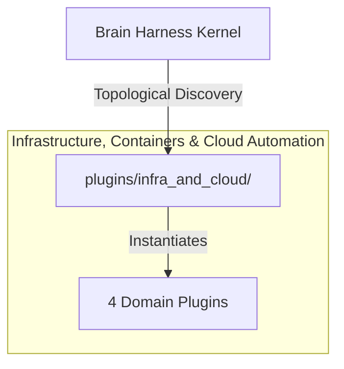

# ☁️ Infrastructure, Containers & Cloud Automation

Declarative CI/CD pipeline scaffolding, Docker container runtimes, Kubernetes deployment manifests, and Terraform infrastructure-as-code automation.

---

## Category Architecture

Plugins within `infra_and_cloud` adhere to the single-responsibility domain partitioning invariant (Rule 18). Each capability is encapsulated in a dedicated directory with independent manifests, isolation boundaries, and typed `ServiceKey[T]` declarations.

---

## Member Plugins Catalog

| Plugin | Isolation | Provided Services | Summary |
|---|---|---|---|
| [ci_pipeline](ci_pipeline/README.md) | `in_process` | None | CI/CD pipeline workflow linter, circular job dependency detector, and action security auditor |
| [docker_container](docker_container/README.md) | `in_process` | None | Docker container linter, multi-stage Dockerfile generator, and container security auditor |
| [k8s_manifest](k8s_manifest/README.md) | `in_process` | None | Kubernetes manifest linter, resource request/limit validator, and pod security context checker |
| [terraform_iac](terraform_iac/README.md) | `in_process` | None | Terraform / OpenTofu HCL parser, state drift detector, and cloud resource cost estimator |

---

## Invariants & Execution Boundaries

1. Domain Partitioning (Rule 18): Plugins in `infra_and_cloud` do not mix cross-domain concerns.
2. Typed Service Registration (Rule 2): All services register using typed `ServiceKey[T]` contracts.
3. Subprocess Isolation (Rule 5 & 7): Untrusted and heavy external dependencies execute in isolated subprocess sandboxes with lazy venv provisioning.
4. Zero-Fork Config (Rule 44): Baseline operational budgets reside in co-located `config.default.yaml`.
