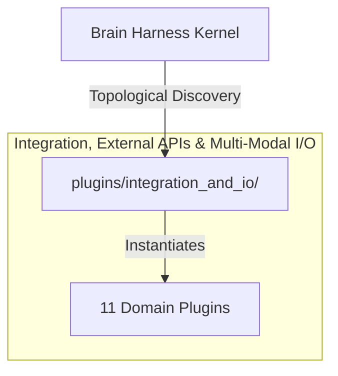

# 🔌 Integration, External APIs & Multi-Modal I/O

External API integrations, OpenRouter LLM gateway with Context Epoch caching, Stagehand & WebWright browser automation, AgentWikis documentation routers, and multimedia YouTube dialogue extractors.

---

## Category Architecture

Plugins within `integration_and_io` adhere to the single-responsibility domain partitioning invariant (Rule 18). Each capability is encapsulated in a dedicated directory with independent manifests, isolation boundaries, and typed `ServiceKey[T]` declarations.

---

## Member Plugins Catalog

| Plugin | Isolation | Provided Services | Summary |
|---|---|---|---|
| [agentwikis](agentwikis/README.md) | `in_process` | `service.agentwikis` | AgentWikis knowledge discovery, boundary triage, and offline documentation slicing |
| [api_openapi](api_openapi/README.md) | `in_process` | `service.openapi_spec` | OpenAPI / Swagger 3.0 specification synthesis, schema validation, and mock response generator |
| [cellcog](cellcog/README.md) | `subprocess` | `service.cellcog` | Any-to-any multimodal sub-agent delegation via CellCog SDK — research, media, documents, code |
| [notification_webhook](notification_webhook/README.md) | `in_process` | `service.notification_webhook` | Webhook notification dispatcher, Slack & Discord card builder, and agent event broadcaster |
| [openrouter_gateway](openrouter_gateway/README.md) | `in_process` | `service.openrouter_gateway` | OpenRouter Gateway routing, JSON-RPC 2.0 protocol engine, and Context Epoch prompt optimizer |
| [stagehand_browser](stagehand_browser/README.md) | `subprocess` | None | Browserbase's next-generation AI browser automation engine with Act, Extract, Observe, and WebMCP protocol integration |
| [symbolic_solver](symbolic_solver/README.md) | `in_process` | `service.symbolic_solver` | Neuro-symbolic constraint solver, safe arithmetic evaluation, and Horn-clause rule engine |
| [web_fetcher](web_fetcher/README.md) | `in_process` | `service.web_fetcher` | Clean web page fetcher, automated HTML-to-Markdown distillation, and custom HTTP request client |
| [webwright_harness](webwright_harness/README.md) | `subprocess` | None | SWE-style browser agent harness with trajectory skill learning, semantic retrieval, parameterized routing, persistent... |
| [youtube_transcript_fetcher](youtube_transcript_fetcher/README.md) | `subprocess` | `service.youtube_transcript_fetcher` | Extract transcripts and timed captions from YouTube video URLs or IDs via isolated subprocess JSON-RPC |
| [gradio_app_architect](gradio_app_architect/README.md) | `in_process` | `service.gradio_app_architect` | Production AI interface engineering, AST diagnostic inspection, and decoupled 3-tier scaffolding for Gradio (Eva J Patel 2026) |
| [gemini_vercel_streaming_chatbot](gemini_vercel_streaming_chatbot/README.md) | `in_process` | `service.gemini_vercel_streaming` | Production AI chatbot engineering with Google Gemini & Vercel Serverless plain-text chunk streaming (Johnson Samuel 2026) |

---

## Invariants & Execution Boundaries

1. Domain Partitioning (Rule 18): Plugins in `integration_and_io` do not mix cross-domain concerns.
2. Typed Service Registration (Rule 2): All services register using typed `ServiceKey[T]` contracts.
3. Subprocess Isolation (Rule 5 & 7): Untrusted and heavy external dependencies execute in isolated subprocess sandboxes with lazy venv provisioning.
4. Zero-Fork Config (Rule 44): Baseline operational budgets reside in co-located `config.default.yaml`.
