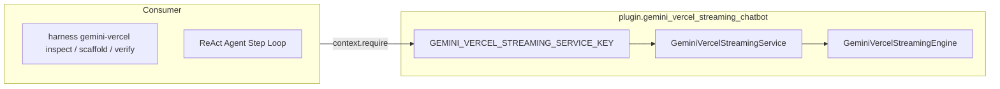

# Gemini & Vercel Streaming Chatbot Plugin

The `plugin.gemini_vercel_streaming_chatbot` plugin provides production AI chatbot engineering, diagnostic code inspection, plain-text chunk streaming simulation, and decoupled 3-tier scaffolding for Gemini and Vercel Serverless architectures.

Synthesized from Johnson Samuel's literature (*How to Build an AI Chatbot with Gemini and Vercel Serverless Functions 🚀*, freeCodeCamp, 2026), this plugin eliminates multi-second response latency, cross-origin CORS preflight browser blocks, unbuffered proxy buffering, and client stream reader stalls.

---

## Architecture & System Context



---

## Features

1. **5-Point Diagnostic Static Analysis**:
   - `STREAM_CHUNKING`: Enforces `generateContentStream()` + `res.write(chunk.text)`. Flags monolithic `res.json()`.
   - `CORS_PREFLIGHT_GATE`: Enforces explicit `req.method === 'OPTIONS'` intercept with 200 OK and designated origins.
   - `INPUT_SANITIZATION`: Validates `MAX_TEXT_LENGTH` bounds and 400 Bad Request defensive rejection.
   - `CLIENT_STREAM_READER`: Enforces `ReadableStreamDefaultReader` + `TextDecoder` typewriter loop on frontend.
   - `UNBUFFERED_VERIFICATION_OBSERVABILITY`: Ensures `Cache-Control: no-cache, no-transform` headers and healthcheck probe.
2. **Production 3-Tier Scaffolding**:
   - Backend: `api/chat.js` or `api/chat.ts` with `@google/genai` and plain-text chunk streaming
   - Frontend: `src/ChatWidget.jsx` or `src/ChatWidget.tsx` with `ReadableStreamDefaultReader` and `AbortController`
   - Config: `package.json`, `vercel.json`, `.env.example`, `verify_stream.sh`
3. **Stream Chunking Simulator**:
   - Simulates unbuffered chunk emissions and token piece reconstruction with millisecond latency metrics.
4. **Interactive Standalone Visual Brief**:
   - Generates responsive HTML reports with Tailwind CSS and Mermaid diagrams.

---

## Configuration

Zero-fork baseline budgets are declared in `config.default.yaml`:

```yaml
operational_budgets:
  max_turns: 20
  cost_budget_usd: 2.50
  subprocess_timeout_seconds: 60
  token_budget_bound: 32000
streaming_config:
  max_text_length: 2000
  max_array_length: 50
  default_model: "gemini-2.5-flash"
  enable_terminal_verification: true
  enforce_cors_preflight_gate: true
deployment_policy:
  enforce_env_key_isolation: true
  restrict_cors_origin_in_production: true
```
