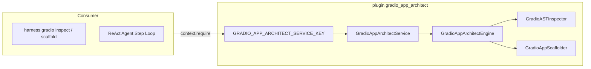

# Gradio App Architect Plugin

The `plugin.gradio_app_architect` plugin provides production AI interface engineering, AST diagnostic inspection, and decoupled 3-tier scaffolding for Gradio applications.

Synthesized from Eva J Patel's literature (*How to Use Gradio with Python: A Complete Beginner-to-Advanced Book*, freeCodeCamp, 2026), this plugin eliminates brittle prototype-to-production failures—such as multi-user global state corruption, GPU VRAM thrashing from model reloading, arity mismatches, and unqueued server blocking.

---

## Architecture & System Context



---

## Features

1. **AST Static Diagnostics**: Evaluates Python code against 5 production rubrics:
   - Headless decoupling of pure computation logic
   - Session state isolation via `gr.State` (zero mutable global state)
   - Exact positional arity and cardinality matching
   - Module-scope singleton warm-loading
   - Queued concurrency verification for streaming generators
2. **Production 3-Tier Scaffolding**:
   - `logic.py`: Pure domain functions, 100% testable in headless pytest
   - `app.py`: Declarative `gr.Blocks` hierarchy with session state and queued load shedding
   - `requirements.txt`: Pinned dependencies
   - `README.md`: Hugging Face Spaces deployment frontmatter
3. **Interactive Visual Brief**:
   - Generates standalone HTML dashboards with Tailwind CSS and Mermaid diagrams

---

## Configuration

Zero-fork baseline budgets are declared in `config.default.yaml`:

```yaml
operational_budgets:
  ast_inspection_timeout_sec: 10
  scaffolding_timeout_sec: 15
  default_concurrency_limit: 5
  max_queue_size: 50
  max_upload_size_mb: 25
```

---

## CLI Usage

Inspect any Gradio file:
```bash
harness gradio inspect path/to/app.py
```

Scaffold a decoupled production application:
```bash
harness gradio scaffold --name my_ai_app --topology blocks
```

Generate an interactive visual brief:
```bash
harness gradio brief
```
