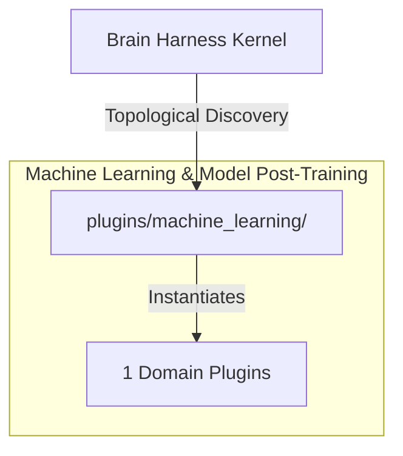

# 🧠 Machine Learning & Model Post-Training

Supervised fine-tuning harnesses, post-training optimization pipelines, and model evaluation telemetry using Tunix.

---

## Category Architecture

Plugins within `machine_learning` adhere to the single-responsibility domain partitioning invariant (Rule 18). Each capability is encapsulated in a dedicated directory with independent manifests, isolation boundaries, and typed `ServiceKey[T]` declarations.

---

## Member Plugins Catalog

| Plugin | Isolation | Provided Services | Summary |
|---|---|---|---|
| [google_tunix_posttraining](google_tunix_posttraining/README.md) | `subprocess` | `service.google_tunix_posttraining` | Google Tunix (Tune-in-JAX) post-training bridge: GRPO, PPO, PEFT/LoRA configuration, execution launcher, and math rea... |

---

## Invariants & Execution Boundaries

1. Domain Partitioning (Rule 18): Plugins in `machine_learning` do not mix cross-domain concerns.
2. Typed Service Registration (Rule 2): All services register using typed `ServiceKey[T]` contracts.
3. Subprocess Isolation (Rule 5 & 7): Untrusted and heavy external dependencies execute in isolated subprocess sandboxes with lazy venv provisioning.
4. Zero-Fork Config (Rule 44): Baseline operational budgets reside in co-located `config.default.yaml`.
