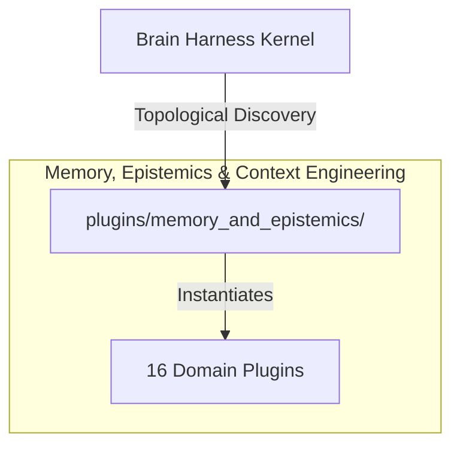

# 📚 Memory, Epistemics & Context Engineering

Multi-store autobiographical memory federation, OKF memory governance, Graphiti knowledge graphs, MemGraphRAG, context compactor/compiler pipelines, decay scoring, and prompt pruning layers.

---

## Category Architecture

Plugins within `memory_and_epistemics` adhere to the single-responsibility domain partitioning invariant (Rule 18). Each capability is encapsulated in a dedicated directory with independent manifests, isolation boundaries, and typed `ServiceKey[T]` declarations.

---

## Member Plugins Catalog

| Plugin | Isolation | Provided Services | Summary |
|---|---|---|---|
| [brain_bridge](brain_bridge/README.md) | `in_process` | `service.brain_bridge` | Mounts, inspects, and federates external agent brains, Git/GitHub repositories, IDE transcripts, and knowledge libraries |
| [context_compactor](context_compactor/README.md) | `in_process` | `service.context_compactor` | Agent trajectory summarization, context compaction, and persistent memory offloading via Memtext |
| [context_compiler](context_compiler/README.md) | `subprocess` | None | AST-based 3-tier token-efficient context compilation, skeletonization, and reachability resolver for agent workflows |
| [context_type_system](context_type_system/README.md) | `in_process` | None | Context provenance, type channel separation, origin ledger verification, token budgeting, and prompt assembly engine |
| [embedding_cluster](embedding_cluster/README.md) | `in_process` | `service.embedding_cluster` | Unsupervised text chunk clustering, topic keyword extraction, and cluster summary generator |
| [graphiti_memory](graphiti_memory/README.md) | `in_process` | None | Temporal knowledge graph engine with bi-temporal edge invalidation and tri-brid search reranking |
| [hermes_state_fts5](hermes_state_fts5/README.md) | `in_process` | `service.hermes_state_fts5` | Hermes SQLite WAL state storage with FTS5 search, parent-child session compression splitting, and cross-session recall |
| [media_mind_forge](media_mind_forge/README.md) | `in_process` | `service.media_mind_forge` | Cognitive analysis, epistemic distillation, and skill forging engine combining book-to-skill-forge and mind-reader |
| [memgraphrag](memgraphrag/README.md) | `subprocess` | None | Three-layer memory knowledge graph engine with conflict-aware graph construction and hybrid PPR retrieval |
| [memory_decay_engine](memory_decay_engine/README.md) | `subprocess` | None | Ebbinghaus forgetting curve memory engine with channel multipliers, snapshot session persistence, and composite ranking |
| [okf_memory](okf_memory/README.md) | `in_process` | `service.okf_memory` | Git-native agent memory governor providing BM25 search, pre-edit governance scoping, concept mutations, and trust ord... |
| [prompt_benchmark](prompt_benchmark/README.md) | `in_process` | `service.prompt_benchmark` | LLM output evaluation, BLEU/ROUGE ngram similarity scoring, and regression benchmark suite |
| [prompt_pruning_layer](prompt_pruning_layer/README.md) | `subprocess` | None | Deterministic 3-pass prompt optimization engine (expired context elimination, duplicate passage reduction, and depend... |
| [semantic_cache](semantic_cache/README.md) | `in_process` | `service.semantic_cache` | Similarity-based semantic cache for LLM prompts and agent task results |
| [skill_knowledge_graph](skill_knowledge_graph/README.md) | `in_process` | `service.skill_knowledge_graph`, `service.skill_registry` | Knowledge graph indexer, semantic router, and visual topology generator for agent skill cards |
| [vector_index](vector_index/README.md) | `in_process` | `service.vector_index` | Local semantic vector index, natural language code/doc retrieval, and hybrid search |

---

## Invariants & Execution Boundaries

1. Domain Partitioning (Rule 18): Plugins in `memory_and_epistemics` do not mix cross-domain concerns.
2. Typed Service Registration (Rule 2): All services register using typed `ServiceKey[T]` contracts.
3. Subprocess Isolation (Rule 5 & 7): Untrusted and heavy external dependencies execute in isolated subprocess sandboxes with lazy venv provisioning.
4. Zero-Fork Config (Rule 44): Baseline operational budgets reside in co-located `config.default.yaml`.
