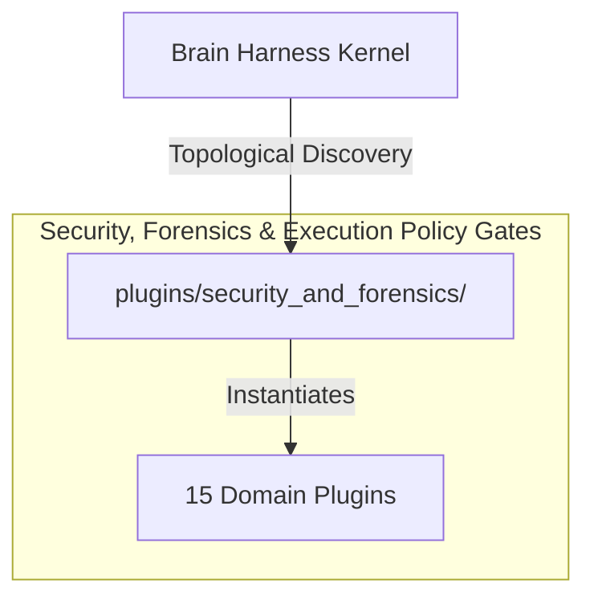

# 🛡️ Security, Forensics & Execution Policy Gates

Codex execution policies, runtime policy gates, Vibe dynamic security scanners, secret leak detection, network/log forensic analysis, and trajectory audits.

---

## Category Architecture

Plugins within `security_and_forensics` adhere to the single-responsibility domain partitioning invariant (Rule 18). Each capability is encapsulated in a dedicated directory with independent manifests, isolation boundaries, and typed `ServiceKey[T]` declarations.

---

## Member Plugins Catalog

| Plugin | Isolation | Provided Services | Summary |
|---|---|---|---|
| [antigravity_policy_gate](antigravity_policy_gate/README.md) | `in_process` | `service.antigravity.policy_gate` | Google Antigravity declarative security policy gate enforcing tri-state allow/deny/ask_user tool evaluation |
| [codex_execpolicy](codex_execpolicy/README.md) | `in_process` | None | Deterministic AST-level shell command execution policy, approval elevation, and sandbox resolution engine ported from... |
| [log_forensics](log_forensics/README.md) | `in_process` | None | High-throughput SIEM log stream parser, anomaly detection, and incident timeline reconstructor |
| [magika_content_detector](magika_content_detector/README.md) | `subprocess` | `service.magika_content_detector` | Google Magika deep-learning file content type, MIME detection, and batch directory classification engine |
| [magika_format_forensics](magika_format_forensics/README.md) | `subprocess` | `service.magika_format_forensics` | Google Magika format forensics: extension spoofing detection, polyglot binary auditing, and upload quarantine gating |
| [mantis_sandbox_verifier](mantis_sandbox_verifier/README.md) | `subprocess` | `service.mantis_sandbox_verifier` | Google Mantis sandboxed crash reproduction, vulnerability PoC execution, and transactional patch verification |
| [mantis_security_review](mantis_security_review/README.md) | `in_process` | `service.mantis_security_review` | Google Mantis autonomous security review pipeline, VCS history mining, deduplication ladder, and risk calibration |
| [network_forensics](network_forensics/README.md) | `in_process` | None | Network traffic metadata analyzer, TLS cert inspector, and port security auditor |
| [pre_commit_security_guard](pre_commit_security_guard/README.md) | `in_process` | `service.pre_commit_security_guard` | Shift-left SAST, Shannon entropy secret interception, deliberate synthetic smoke tests, and SARIF dual-gate CI defense |
| [pyrit_redteaming](pyrit_redteaming/README.md) | `subprocess` | None | Microsoft PyRIT AI Red Teaming & Harm Evaluation Engine for multi-turn crescendo attacks, adversarial prompt converte... |
| [secret_scanner](secret_scanner/README.md) | `in_process` | None | Pre-ingestion and on-demand credential & API key scanner with Shannon entropy analysis |
| [security_scanner](security_scanner/README.md) | `in_process` | None | Static code vulnerability scanner, secret detection, and dependency audit plugin |
| [threat_modeler](threat_modeler/README.md) | `in_process` | None | STRIDE threat modeling, MITRE ATT&CK taxonomy mapping, and attack graph generator |
| [trajectory_auditor](trajectory_auditor/README.md) | `in_process` | None | Agent trajectory step auditor, repetitive loop / stuck detector, and recovery prompt synthesizer |
| [vibe_scanner](vibe_scanner/README.md) | `subprocess` | None | Static AST security scanner detecting AI-generated code vulnerabilities, secrets, SQL injection, path traversal, weak... |

---

## Invariants & Execution Boundaries

1. Domain Partitioning (Rule 18): Plugins in `security_and_forensics` do not mix cross-domain concerns.
2. Typed Service Registration (Rule 2): All services register using typed `ServiceKey[T]` contracts.
3. Subprocess Isolation (Rule 5 & 7): Untrusted and heavy external dependencies execute in isolated subprocess sandboxes with lazy venv provisioning.
4. Zero-Fork Config (Rule 44): Baseline operational budgets reside in co-located `config.default.yaml`.
