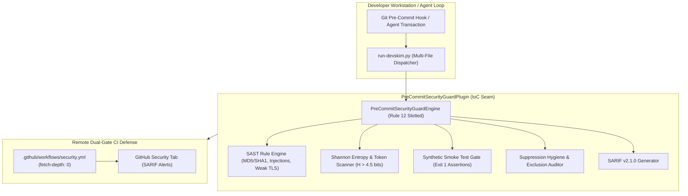

# 🛡️ Pre-Commit Security Guard Plugin

The `pre_commit_security_guard` plugin delivers shift-left static application security testing (SAST) and Shannon entropy credential interception to developer workstations and CI runners.

Synthesizing Umair Mirza's literature (*"How to Catch Security Vulnerabilities in Code Before They Reach Your Pull Requests"*, freeCodeCamp, 2026, `ki_umairmirza_precommit_security`), this plugin establishes a dual-scanner defense pairing AST/lexical pattern linting with high-entropy secret detection, backed by deliberate synthetic failure smoke tests and GitHub SARIF dual-gate CI reporting.

---

## Capabilities & Architecture



---

## Service Registration (Rule 45)

The plugin registers into the Harness IoC container under:
- **ServiceKey**: `ServiceKey[PreCommitSecurityGuardService]("service.pre_commit_security_guard")`
- **Protocol**: `PreCommitSecurityGuardService`

### Usage in ReAct Agent Loops or Extensions
```python
from harness.kernel.context import ServiceContext
from harness.services.pre_commit_security_guard import PRE_COMMIT_SECURITY_GUARD_SERVICE_KEY

# Resolve service from container
security_service = context.require(PRE_COMMIT_SECURITY_GUARD_SERVICE_KEY)

# Scan files before transaction commit
report = security_service.scan_staged_files(["src/api/auth.py", "config.yaml"])
if not report.passed:
    raise SecurityViolationError(f"Found {len(report.findings)} security violations")
```

---

## Click CLI Seams (Rule 6, Rule 10)

Commands are registered under `harness pre-commit-security` (aliases: `security-guard`, `shift-left`):

```bash
# Scan specific files or staged diffs
harness pre-commit-security scan src/main.py --json-output

# Run deliberate synthetic failure smoke tests
harness pre-commit-security smoke-test

# Audit repository for suppression hygiene and blanket exclusions
harness pre-commit-security audit-suppressions --root .

# Audit remote CI dual-gate configuration
harness pre-commit-security audit-ci --workflow .github/workflows/security.yml

# Generate interactive HTML visual brief
harness pre-commit-security brief
```
