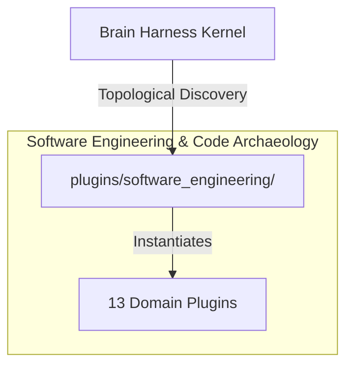

# 💻 Software Engineering & Code Archaeology

Architectural linting, isolated code execution, transactional Git filesystem checkpoints, automated refactoring engines, PR lens architectural diff visualizers, and repo triad forge pipelines.

---

## Category Architecture

Plugins within `software_engineering` adhere to the single-responsibility domain partitioning invariant (Rule 18). Each capability is encapsulated in a dedicated directory with independent manifests, isolation boundaries, and typed `ServiceKey[T]` declarations.

---

## Member Plugins Catalog

| Plugin | Isolation | Provided Services | Summary |
|---|---|---|---|
| [arch_linter](arch_linter/README.md) | `in_process` | `service.arch_linter` | Codebase coupling/cohesion analyzer, circular import detector, and clean architecture boundary verifier |
| [artifact_generator](artifact_generator/README.md) | `in_process` | `service.artifact_generator` | Interactive HTML report generation, Mermaid diagram visualization, and executive briefings |
| [code_runner](code_runner/README.md) | `in_process` | `service.code_runner` | Sandboxed Python REPL and script execution engine with output capture and timeout protection |
| [django_bridge](django_bridge/README.md) | `in_process` | None | High-leverage Django ecosystem bridge for deep AST project inspection, safe management command execution, declarative... |
| [filesystem_git](filesystem_git/README.md) | `in_process` | `service.filesystem_git` | Safe filesystem navigation, line-slice reading, regex search, and git operations |
| [google_styleguide_auditor](google_styleguide_auditor/README.md) | `subprocess` | `service.google_styleguide_auditor` | Google Style Guide auditor and linter config generator for Python, C++, TypeScript, Java, and Shell. |
| [mantis_structural_index](mantis_structural_index/README.md) | `in_process` | `service.mantis_structural_index` | Google Mantis AST content-addressed semantic-unit indexing and SQLite symbol querying |
| [migration_assistant](migration_assistant/README.md) | `in_process` | `service.migration_assistant` | Python framework migration checker (Pydantic v1 to v2, Python 3.10+ union syntax, unittest to pytest) |
| [perfetto_trace_processor](perfetto_trace_processor/README.md) | `subprocess` | `service.perfetto_trace_processor` | Google Perfetto Trace Processor plugin: trace file loading, SQL querying against sched/slice tables, performance metr... |
| [pr_lens_graph](pr_lens_graph/README.md) | `subprocess` | `service.pr_lens_graph` | PR Lens standalone animated SVG architecture diagrams, graph validation, and diff visualization |
| [refactor_engine](refactor_engine/README.md) | `in_process` | `service.refactor_engine` | Python AST refactoring engine, dead/unused code identifier, and function extraction tool |
| [repo_triad_forge](repo_triad_forge/README.md) | `subprocess` | `service.repo_triad_forge` | Authoritative Repo-Triad Forge plugin: 5-stage repository cognitive audit, visual brief generation, Knowledge Vault c... |
| [test_runner](test_runner/README.md) | `in_process` | `service.test_runner` | Autonomous test discovery, test execution, and structured failure parsing for TDD workflows |

---

## Invariants & Execution Boundaries

1. Domain Partitioning (Rule 18): Plugins in `software_engineering` do not mix cross-domain concerns.
2. Typed Service Registration (Rule 2): All services register using typed `ServiceKey[T]` contracts.
3. Subprocess Isolation (Rule 5 & 7): Untrusted and heavy external dependencies execute in isolated subprocess sandboxes with lazy venv provisioning.
4. Zero-Fork Config (Rule 44): Baseline operational budgets reside in co-located `config.default.yaml`.
